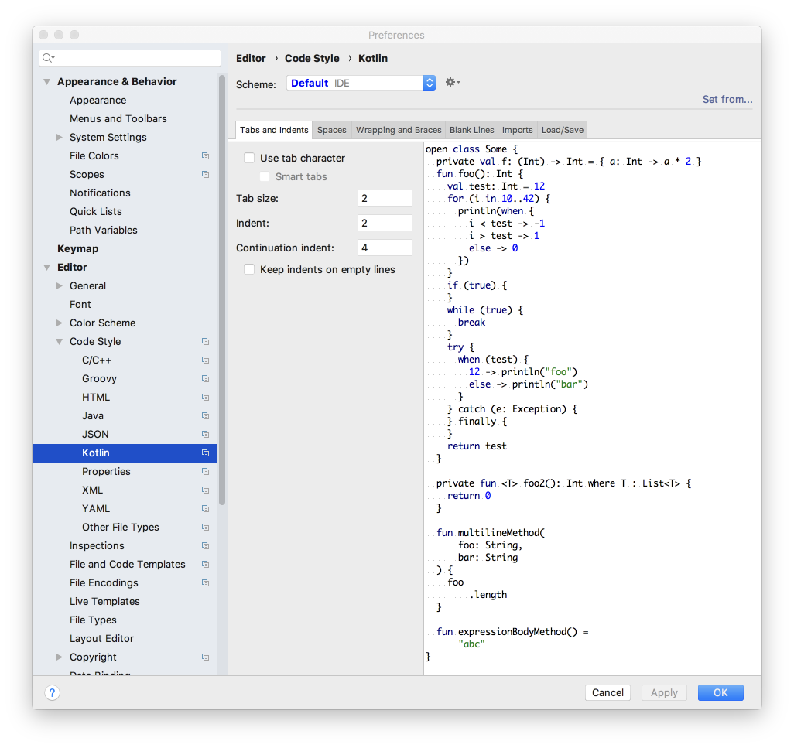

# Setup

Download and install the latest Android Studio (3.2 when this lab was updated last).

## Indentation Levels

Run studio - and change the code settings to use tab size = 2, indent = 2 and continuation indent = 4 for Kotlin:

Do the same for XML, Groovy, Java and JSON. 
