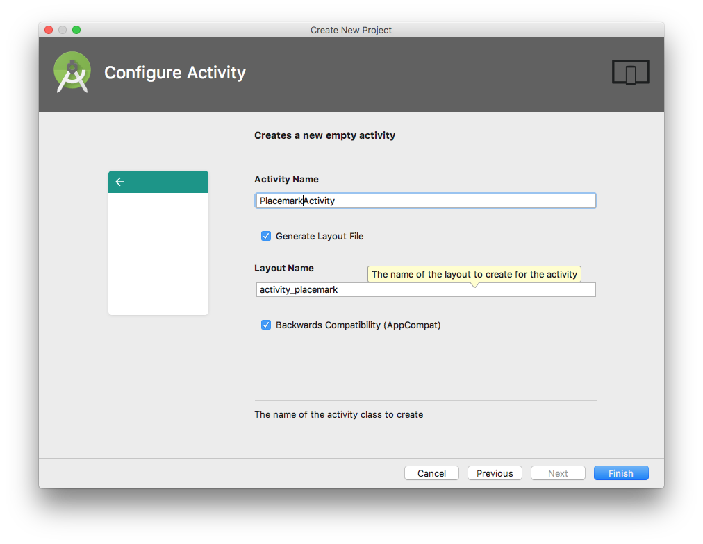

## New Project

Create an new Android project with the following key characteristics:

- Kotlin
- Single 'Blank' activity

Follow the structure and parameters outlined here:

Your project should look like this:

