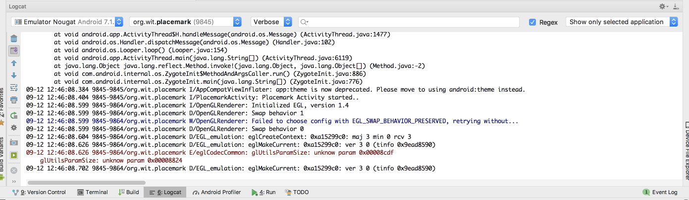

# Logging Event Handling in Kotlin

We are going to be working exclusively in Kotlin - not Java. This affords considerable improvements, largely around conciseness and expressiveness of code.

## Logging

To prepare for this, include this additional dependency in our gradle.build:

## gradle.build

~~~
  implementation 'org.jetbrains.anko:anko-commons:0.10.7'
~~~

Your dependencies section will look like this now:

~~~
dependencies {
  implementation fileTree(dir: 'libs', include: ['*.jar'])
  implementation "org.jetbrains.kotlin:kotlin-stdlib-jdk7:$kotlin_version"
  implementation 'com.android.support:appcompat-v7:28.0.0'
  implementation 'com.android.support.constraint:constraint-layout:1.1.3'
  implementation 'org.jetbrains.anko:anko-commons:0.10.7'
  testImplementation 'junit:junit:4.12'
  androidTestImplementation 'com.android.support.test:runner:1.0.2'
  androidTestImplementation 'com.android.support.test.espresso:espresso-core:3.0.2'
}
~~~

This library is documented here:

- <https://github.com/Kotlin/anko>

We will be progressively introducing some of its features as we evolve the application.

The first feature is a simple way of logging:

Change the class to include the 'AnkoLogger' feature:

## PlacemarkActivity

~~~
..
class PlacemarkActivity : AppCompatActivity(), AnkoLogger {
...
~~~

When you make this change, AnkoLogger will not be recognised - so you will need to import it. This can be triggered automatically (if you can figure this out). The correct import statement is:

~~~
import org.jetbrains.anko.AnkoLogger
~~~

Then, in our onCreate() method, try it out:

~~~
...
    info("Placemark Activity started..")
...    
~~~

Again, this will require an import - which will be this:

~~~
import org.jetbrains.anko.info
~~~

Try to figure out the key strokes required to generate this...

Now, make sure you can run the app and see this log in the 'Logcat' view in Studio:

Do not proceed further until you can locate something like the above in Logcat. The logss are a bit noisy, and may contain what look like errors. However, buried in there should be your message.

This style of logging is discussed here:

- <https://github.com/Kotlin/anko/wiki/Anko-Commons-%E2%80%93-Logging>
