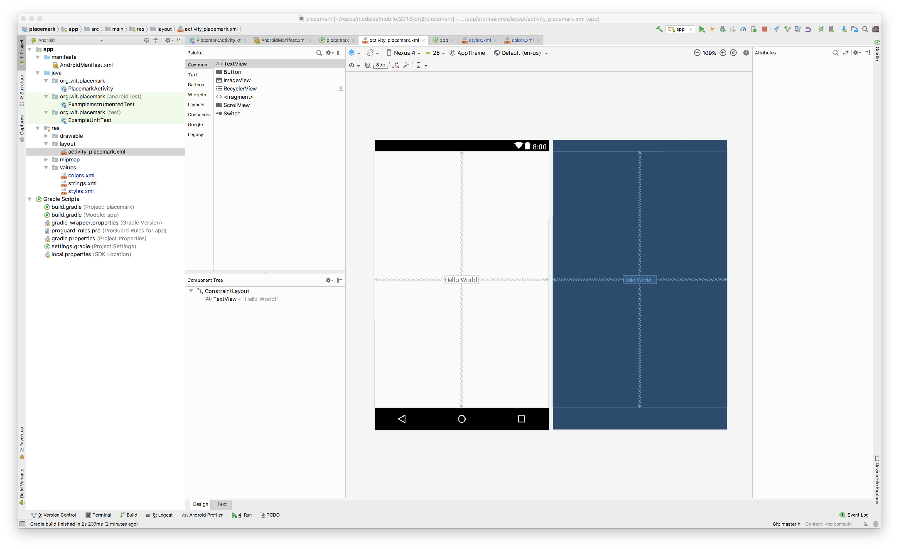
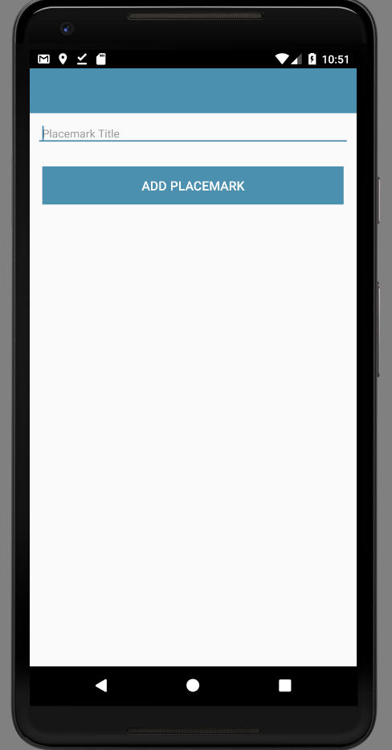

# Layouts

Working with `activity_placemark.xml`, progressively introduce the following versions - replacing each with the successive content below. Keep an eye on the `design` view as you progress to notice the changes

## activity_placemark.xml Version A

This is what you currently have (select the `Text` view to reveal this):

~~~
<?xml version="1.0" encoding="utf-8"?>
<android.support.constraint.ConstraintLayout
    xmlns:android="http://schemas.android.com/apk/res/android"
    xmlns:app="http://schemas.android.com/apk/res-auto"
    xmlns:tools="http://schemas.android.com/tools"
    android:layout_width="match_parent"
    android:layout_height="match_parent"
    tools:context="org.wit.placemark.PlacemarkActivity">

  <TextView
      android:layout_width="wrap_content"
      android:layout_height="wrap_content"
      android:text="Hello World!"
      app:layout_constraintBottom_toBottomOf="parent"
      app:layout_constraintLeft_toLeftOf="parent"
      app:layout_constraintRight_toRightOf="parent"
      app:layout_constraintTop_toTopOf="parent"/>

</android.support.constraint.ConstraintLayout>
~~~

## activity_placemark.xml Version B 

Now make tee following change  ... replace the current contents to include relative layout + toolbar

~~~
<?xml version="1.0" encoding="utf-8"?>
<android.support.constraint.ConstraintLayout
    xmlns:android="http://schemas.android.com/apk/res/android"
    xmlns:app="http://schemas.android.com/apk/res-auto"
    xmlns:tools="http://schemas.android.com/tools"
    android:layout_width="match_parent"
    android:layout_height="match_parent"
    tools:context="org.wit.placemark.PlacemarkActivity">

  <RelativeLayout
      android:layout_width="match_parent"
      android:layout_height="wrap_content">

    <android.support.design.widget.AppBarLayout
        android:id="@+id/appBarLayout"
        android:layout_width="match_parent"
        android:layout_height="wrap_content"
        android:background="@color/colorAccent"
        android:fitsSystemWindows="true"
        app:elevation="0dip"
        app:theme="@style/ThemeOverlay.AppCompat.Dark.ActionBar">

      <android.support.v7.widget.Toolbar
          android:id="@+id/toolbarAdd"
          android:layout_width="match_parent"
          android:layout_height="wrap_content"
          app:titleTextColor="@color/colorPrimary"/>
    </android.support.design.widget.AppBarLayout>

  </RelativeLayout>
</android.support.constraint.ConstraintLayout>
~~~

Keep an eye on the Design view as you make this change.

## activity_placemark.xml Version C 

... augment with a scroll view containing a linear layout:

~~~
<?xml version="1.0" encoding="utf-8"?>
<android.support.constraint.ConstraintLayout
    xmlns:android="http://schemas.android.com/apk/res/android"
    xmlns:app="http://schemas.android.com/apk/res-auto"
    xmlns:tools="http://schemas.android.com/tools"
    android:layout_width="match_parent"
    android:layout_height="match_parent"
    tools:context="org.wit.placemark.PlacemarkActivity">

  <RelativeLayout
      android:layout_width="match_parent"
      android:layout_height="wrap_content">

    <android.support.design.widget.AppBarLayout
        android:id="@+id/appBarLayout"
        android:layout_width="match_parent"
        android:layout_height="wrap_content"
        android:background="@color/colorAccent"
        android:fitsSystemWindows="true"
        app:elevation="0dip"
        app:theme="@style/ThemeOverlay.AppCompat.Dark.ActionBar">

      <android.support.v7.widget.Toolbar
          android:id="@+id/toolbarAdd"
          android:layout_width="match_parent"
          android:layout_height="wrap_content"
          app:titleTextColor="@color/colorPrimary"/>
    </android.support.design.widget.AppBarLayout>

    <ScrollView
        android:layout_width="match_parent"
        android:layout_height="match_parent"
        android:layout_below="@id/appBarLayout"
        android:fillViewport="true">

      <LinearLayout
          android:layout_width="match_parent"
          android:layout_height="wrap_content"
          android:orientation="vertical">

      </LinearLayout>
    </ScrollView>

  </RelativeLayout>
</android.support.constraint.ConstraintLayout>
~~~

## activity_placemark.xml Version D 

... scroll view linear layout contains a text edit field:

~~~
<?xml version="1.0" encoding="utf-8"?>
<android.support.constraint.ConstraintLayout
    xmlns:android="http://schemas.android.com/apk/res/android"
    xmlns:app="http://schemas.android.com/apk/res-auto"
    xmlns:tools="http://schemas.android.com/tools"
    android:layout_width="match_parent"
    android:layout_height="match_parent"
    tools:context="org.wit.placemark.PlacemarkActivity">

  <RelativeLayout
      android:layout_width="match_parent"
      android:layout_height="wrap_content">

    <android.support.design.widget.AppBarLayout
        android:id="@+id/appBarLayout"
        android:layout_width="match_parent"
        android:layout_height="wrap_content"
        android:background="@color/colorAccent"
        android:fitsSystemWindows="true"
        app:elevation="0dip"
        app:theme="@style/ThemeOverlay.AppCompat.Dark.ActionBar">

      <android.support.v7.widget.Toolbar
          android:id="@+id/toolbarAdd"
          android:layout_width="match_parent"
          android:layout_height="wrap_content"
          app:titleTextColor="@color/colorPrimary"/>
    </android.support.design.widget.AppBarLayout>

    <ScrollView
        android:layout_width="match_parent"
        android:layout_height="match_parent"
        android:layout_below="@id/appBarLayout"
        android:fillViewport="true">

      <LinearLayout
          android:layout_width="match_parent"
          android:layout_height="wrap_content"
          android:orientation="vertical">

        <android.support.design.widget.TextInputEditText
            android:id="@+id/placemarkTitle"
            android:layout_width="match_parent"
            android:layout_height="wrap_content"
            android:layout_margin="8dp"
            android:hint="@string/hint_placemarkTitle"
            android:inputType="text"
            android:maxLength="25"
            android:maxLines="1"
            android:padding="8dp"
            android:textColor="@color/colorPrimaryDark"
            android:textSize="14sp"/>

      </LinearLayout>
    </ScrollView>

  </RelativeLayout>
</android.support.constraint.ConstraintLayout>
~~~

The above needs a new string resource:

## strings.xml

~~~
<resources>
  <string name="app_name">Placemark</string>
  <string name="hint_placemarkTitle">Placemark Title</string>
</resources>
~~~

## activity_placemark.xml Version E 

... a new button in the layout

~~~
<?xml version="1.0" encoding="utf-8"?>
<android.support.constraint.ConstraintLayout
xmlns:android="http://schemas.android.com/apk/res/android"
xmlns:app="http://schemas.android.com/apk/res-auto"
xmlns:tools="http://schemas.android.com/tools"
android:layout_width="match_parent"
android:layout_height="match_parent"
tools:context="org.wit.placemark.PlacemarkActivity">

<RelativeLayout
    android:layout_width="match_parent"
    android:layout_height="wrap_content">

  <android.support.design.widget.AppBarLayout
      android:id="@+id/appBarLayout"
      android:layout_width="match_parent"
      android:layout_height="wrap_content"
      android:background="@color/colorAccent"
      android:fitsSystemWindows="true"
      app:elevation="0dip"
      app:theme="@style/ThemeOverlay.AppCompat.Dark.ActionBar">

    <android.support.v7.widget.Toolbar
        android:id="@+id/toolbarAdd"
        android:layout_width="match_parent"
        android:layout_height="wrap_content"
        app:titleTextColor="@color/colorPrimary"/>
  </android.support.design.widget.AppBarLayout>

  <ScrollView
      android:layout_width="match_parent"
      android:layout_height="match_parent"
      android:layout_below="@id/appBarLayout"
      android:fillViewport="true">

    <LinearLayout
        android:layout_width="match_parent"
        android:layout_height="wrap_content"
        android:orientation="vertical">

      <android.support.design.widget.TextInputEditText
          android:id="@+id/placemarkTitle"
          android:layout_width="match_parent"
          android:layout_height="wrap_content"
          android:layout_margin="8dp"
          android:hint="@string/hint_placemarkTitle"
          android:inputType="text"
          android:maxLength="25"
          android:maxLines="1"
          android:padding="8dp"
          android:textColor="@color/colorPrimaryDark"
          android:textSize="14sp"/>

      <Button
          android:id="@+id/btnAdd"
          android:layout_width="match_parent"
          android:layout_height="wrap_content"
          android:layout_margin="16dp"
          android:background="@color/colorAccent"
          android:paddingBottom="8dp"
          android:paddingTop="8dp"
          android:stateListAnimator="@null"
          android:text="@string/button_addPlacemark"
          android:textColor="@color/colorPrimary"
          android:textSize="16sp"/>
    </LinearLayout>
  </ScrollView>

</RelativeLayout>
</android.support.constraint.ConstraintLayout>
~~~

Building layouts textually like this is a useful skill to acquire over time. Initially, you will probably be most comfortable with drawing the layouts using the design view.

Make sure the application launches now - and the design view is presented in the running app

This short article on layouts is as useful primer:

- <https://medium.com/google-developers/layouts-attributes-and-you-9e5a4b4fe32c.