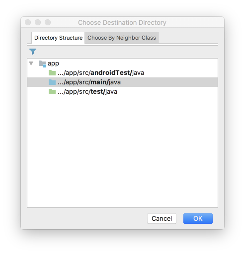
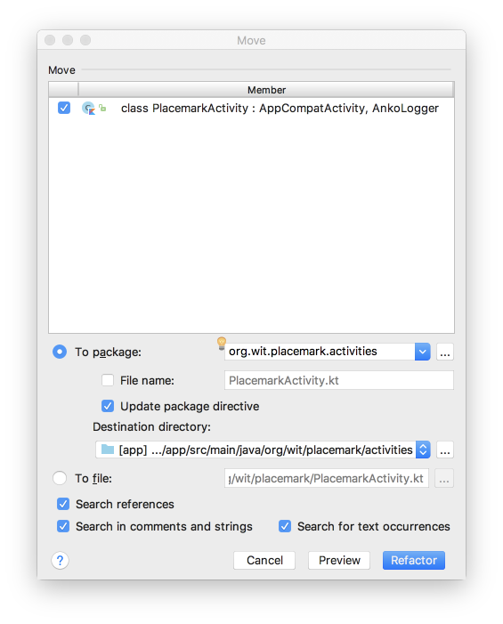

# Refactor

Refactor the application structure such that ActivityPlacemark is in a new package called 'org.wit.placemarks.activities':

You should be able to do this from within the Studio Android perspective. You will be using the context menu to create the new package in the java folder:

and then dragging/dropping the class into this new package. This will automatically trigger refactor step:

Once this is completed, a number of files will be automatically changed:

- AndroidManifest.xml
- PlacemarkActivity.kt
- activity_placemark.xml

See if you can locate each of the changes...

## Models

Introduce a new package called 'models' as shown here:

... and bring in this new class:

## PlacemarkModel

~~~
package org.wit.placemark.models

data class PlacemarkModel(var title: String = "")
~~~

This is an example of a Kotlin Data class:

- <https://antonioleiva.com/data-classes-kotlin/>

Briefly review the above - this is the official documentation:

- <https://kotlinlang.org/docs/reference/data-classes.html>

Here is a new version of PlacemarkActivity that makes use of this model:

~~~
package wit.org.placemark.activities

import android.support.v7.app.AppCompatActivity
import android.os.Bundle
import kotlinx.android.synthetic.main.activity_placemark.*
import org.jetbrains.anko.AnkoLogger
import org.jetbrains.anko.info
import org.jetbrains.anko.toast
import org.wit.placemark.models.PlacemarkModel
import wit.org.placemark.R

class PlacemarkActivity : AppCompatActivity(), AnkoLogger {

  var placemark = PlacemarkModel()

  override fun onCreate(savedInstanceState: Bundle?) {
    super.onCreate(savedInstanceState)
    setContentView(R.layout.activity_placemark)

    btnAdd.setOnClickListener() {
      placemark.title = placemarkTitle.text.toString()
      if (placemark.title.isNotEmpty()) {
        info("add Button Pressed: $placemark")
      }
      else {
        toast ("Please Enter a title")
      }
    }
  }
}
~~~

Read it carefully - notice how we are creating a placemark as a class member:

~~~
  var placemark = PlacemarkModel()
~~~

and then using it in the event handler:

~~~
    btnAdd.setOnClickListener() {
      placemark.title = placemarkTitle.text.toString()
      if (placemark.title.isNotEmpty()) {
        info("add Button Pressed: $placemark")
      }
      else {
        toast ("Please Enter a title")
      }
    }
~~~

