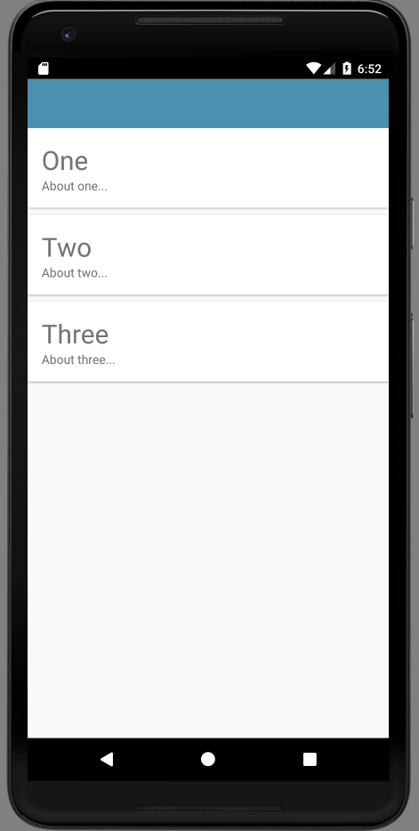

# Card + RecyclerView

To display a list of Placemarks, we will make use of these components:

- CardView
- RecyclerView
- RecyclerViewAdapter

Orchestrating these three is now a familiar patterns in Android development. It is covered briefly in this article here:

- <https://developer.android.com/training/material/lists-cards.html>

This is worth a quick read before proceeding.

## CardView 

CardView itself is supported by a library - which must be included now:

## build.gradle

~~~
...
  implementation 'com.android.support:cardview-v7:28.0.0'
...
~~~

Here is the cardview itself:

## card_placemark.xml

~~~
<?xml version="1.0" encoding="utf-8"?>
<android.support.v7.widget.CardView
    xmlns:android="http://schemas.android.com/apk/res/android"
    android:layout_width="match_parent"
    android:layout_height="wrap_content"
    android:layout_marginBottom="8dp"
    android:elevation="24dp">

  <RelativeLayout
      android:layout_width="match_parent"
      android:layout_height="wrap_content"
      android:padding="16dp">

    <TextView
        android:id="@+id/placemarkTitle"
        android:layout_width="wrap_content"
        android:layout_height="wrap_content"
        android:layout_alignParentTop="true"
        android:textSize="30sp"/>

    <TextView
        android:id="@+id/description"
        android:layout_width="wrap_content"
        android:layout_height="wrap_content"
        android:layout_below="@id/placemarkTitle"/>

  </RelativeLayout>
</android.support.v7.widget.CardView>
~~~

When you rebuild the project, you should be able to view the card in design view.

We can insert the cards into the activity_placemark_list layout - by introducing a RecyclerView widget like this:

## activity_placemark_list.xml

~~~
...
  <android.support.v7.widget.RecyclerView
      android:id="@+id/recyclerView"
      android:layout_width="match_parent"
      android:layout_height="match_parent"
      android:scrollbars="vertical"
      app:layout_behavior="@string/appbar_scrolling_view_behavior"/>
...      
~~~

This is to be inserted just before the closing tag.

## RecyclerView + Adapter

With these resources in place - the PlacemarkListActivity can be reworked to include the RecyclerView + adapter:

## PlacemarkListActivity

~~~
package org.wit.placemark.activities

import android.support.v7.app.AppCompatActivity
import android.os.Bundle
import android.support.v7.widget.LinearLayoutManager
import android.support.v7.widget.RecyclerView
import android.view.LayoutInflater
import android.view.View
import android.view.ViewGroup
import kotlinx.android.synthetic.main.activity_placemark_list.*
import kotlinx.android.synthetic.main.card_placemark.view.*
import org.wit.placemark.R
import org.wit.placemark.main.MainApp
import org.wit.placemark.models.PlacemarkModel

class PlacemarkListActivity : AppCompatActivity() {

  lateinit var app: MainApp

  override fun onCreate(savedInstanceState: Bundle?) {
    super.onCreate(savedInstanceState)
    setContentView(R.layout.activity_placemark_list)
    app = application as MainApp

    val layoutManager = LinearLayoutManager(this)
    recyclerView.layoutManager = layoutManager
    recyclerView.adapter = PlacemarkAdapter(app.placemarks)
  }
}

class PlacemarkAdapter constructor(private var placemarks: List<PlacemarkModel>) : RecyclerView.Adapter<PlacemarkAdapter.MainHolder>() {

  override fun onCreateViewHolder(parent: ViewGroup, viewType: Int): MainHolder {
    return MainHolder(LayoutInflater.from(parent?.context).inflate(R.layout.card_placemark, parent, false))
  }

  override fun onBindViewHolder(holder: MainHolder, position: Int) {
    val placemark = placemarks[holder.adapterPosition]
    holder.bind(placemark)
  }

  override fun getItemCount(): Int = placemarks.size

  class MainHolder constructor(itemView: View) : RecyclerView.ViewHolder(itemView) {

    fun bind(placemark: PlacemarkModel) {
      itemView.placemarkTitle.text = placemark.title
      itemView.description.text = placemark.description
    }
  }
}
~~~

The app should run now - but will still be blank. In MainApp, we can add some test placemarks to test out the Recycler machinery:

## MainApp

~~~
...
  override fun onCreate() {
    super.onCreate()
    info("Placemark started")
    placemarks.add(PlacemarkModel("One", "About one..."))
    placemarks.add(PlacemarkModel("Two", "About two..."))
    placemarks.add(PlacemarkModel("Three", "About three..."))
  }
...
~~~

