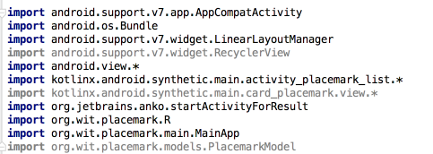

# Exercise Solutions

## Exercise 2: Cancel Button

Incorporate new 'Cancel' action into `PlacemarkActivity`. This should return to PlacemarkListActivity without adding a new Placemark.

## strings.xml

~~~
...
  <string name="menu_cancelPlacemark">Cancel</string>
...
~~~

## menu_placemark.xml

This resources must be in the `menu` folder in `res`

~~~
<?xml version="1.0" encoding="utf-8"?>
<menu xmlns:android="http://schemas.android.com/apk/res/android"
      xmlns:app="http://schemas.android.com/apk/res-auto">

  <item
      android:id="@+id/item_cancel"
      android:title="@string/menu_cancelPlacemark"
      app:showAsAction="always"/>
</menu>
~~~

## PlacemarkActivity

In order to present the toolbar - we need to first support it:

~~~
...
 override fun onCreate(savedInstanceState: Bundle?) {
    ...
    toolbarAdd.title = title
    setSupportActionBar(toolbarAdd)
    ...
    }
  }
...
~~~

Then we need to `inflate` the menu:

~~~
  override fun onCreateOptionsMenu(menu: Menu?): Boolean {
    menuInflater.inflate(R.menu.menu_placemark, menu)
    return super.onCreateOptionsMenu(menu)
  }
~~~

Finally, we need to handle the event:

~~~
  override fun onOptionsItemSelected(item: MenuItem?): Boolean {
    when (item?.itemId) {
      R.id.item_cancel -> {
        finish()
      }
    }
    return super.onOptionsItemSelected(item)
  }
...
~~~

# Exercise 3: Refactor PlacemarkAdapter to its own source file.

The PlacemarkAdapter class is currently in the same source file as the PlacemarkListActivity class. For clarity and ease of maintenance, move this into its own source file.

## PlacemarkAdapter

~~~
package org.wit.placemark.activities

import android.support.v7.widget.RecyclerView
import android.view.LayoutInflater
import android.view.View
import android.view.ViewGroup
import kotlinx.android.synthetic.main.card_placemark.view.*
import org.wit.placemark.R
import org.wit.placemark.models.PlacemarkModel

class PlacemarkAdapter constructor(private var placemarks: List<PlacemarkModel>) : RecyclerView.Adapter<PlacemarkAdapter.MainHolder>() {

  override fun onCreateViewHolder(parent: ViewGroup?, viewType: Int): MainHolder {
    return MainHolder(LayoutInflater.from(parent?.context).inflate(R.layout.card_placemark, parent, false))
  }

  override fun onBindViewHolder(holder: MainHolder, position: Int) {
    val placemark = placemarks[holder.adapterPosition]
    holder.bind(placemark)
  }

  override fun getItemCount(): Int = placemarks.size

  class MainHolder constructor(itemView: View) : RecyclerView.ViewHolder(itemView) {

    fun bind(placemark: PlacemarkModel) {
      itemView.placemarkTitle.text = placemark.title
      itemView.description.text = placemark.description
    }
  }
}
~~~

Delete the PlacemarkAdapter class from PlacemarkListActivity - and rebuild and run the app now to verify that these changes have been engaged correctly.

Check the imports in PlacemarkListActivity:

The greyed out imported are no longer needed (they were used by PlacemarkAdapter). Remove them now and rebuild.

