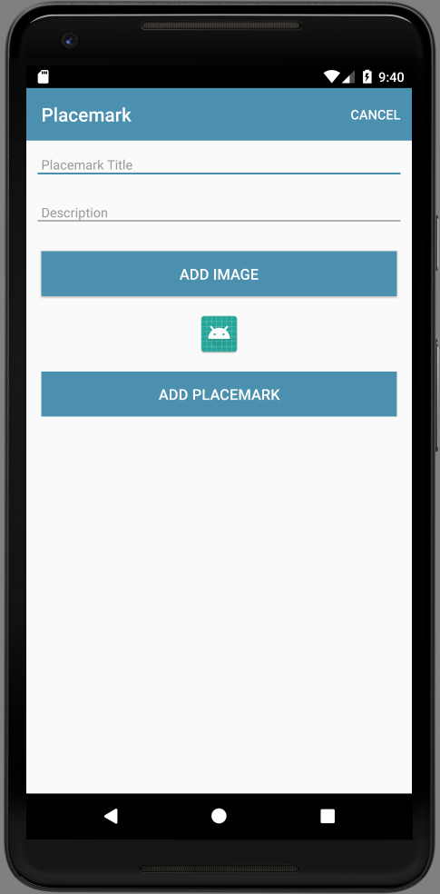

# Add Image UI

We need a new button, which when pressed will allow the user to select an image.

First the button string resource:

## strings.xml

A new string for the button we will introduce:

~~~
  <string name="button_addImage"> Add Image </string>
~~~

Then the button itself + an imageView to display the image:

## activity_placemark.xml

Two new controls:

~~~
        <Button
            android:id="@+id/chooseImage"
            android:layout_width="match_parent"
            android:layout_height="wrap_content"
            android:layout_margin="16dp"
            android:background="@color/colorAccent"
            android:paddingBottom="8dp"
            android:paddingTop="8dp"
            android:text="@string/button_addImage"
            android:textColor="@color/colorPrimary"
            android:textSize="16sp"/>

        <ImageView
            android:id="@+id/placemarkImage"
            android:layout_width="match_parent"
            android:layout_height="wrap_content"
            app:srcCompat="@mipmap/ic_launcher"/>

~~~

We can add these before the `Add Placemark` button.  The view should look like this now:

Take some time to look at the `Design` view in studio:

Remove the controls again - and this time add them using the pallette - dragging and dropping the button + imageView widgits to achieve the same effect. You will notice, however, that we have a set of additional parameters included in our hand coded xml above.

We can add an event handler for the new button:

## PlacemarkActivity

~~~
    chooseImage.setOnClickListener {
      info ("Select image")
    }
~~~

Note that this is `inside` the onCreate method. When you click on the button check that the log message is produced.