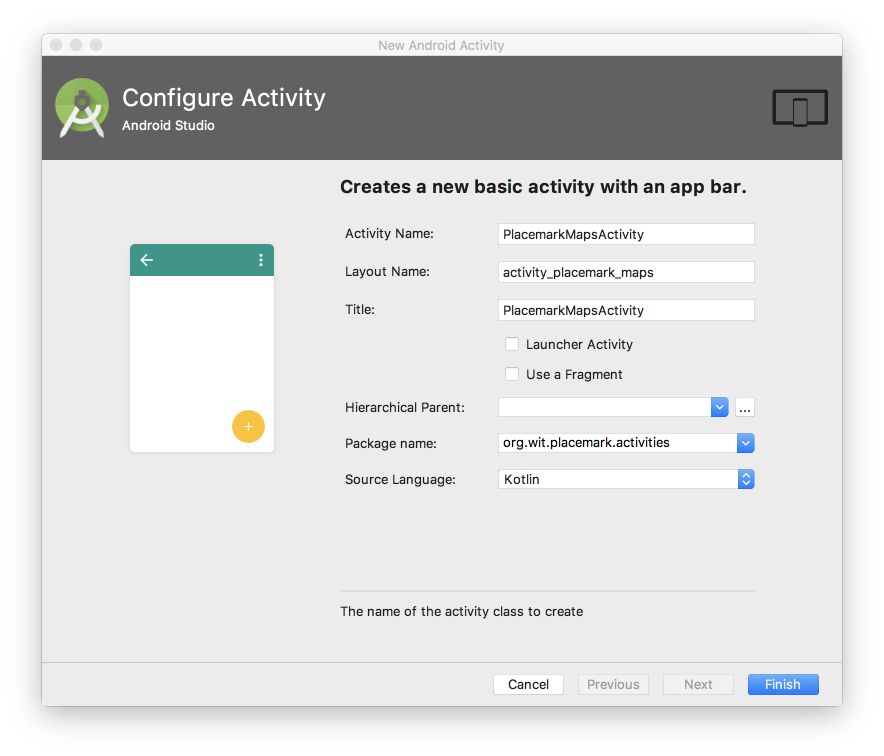
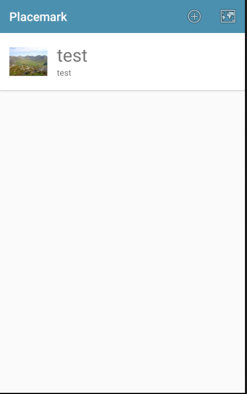

# PlacemarkMapsActivity

We would like a new activity to show all placemarks in our collection. This should be activated by a new menu option.

## Menu

Create a new menu option in the `main_menu.xml`:

## res/menu/menu_main.xml

~~~
<?xml version="1.0" encoding="utf-8"?>
<menu xmlns:android="http://schemas.android.com/apk/res/android"
      xmlns:app="http://schemas.android.com/apk/res-auto">

  <item
    android:id="@+id/item_add"
    android:icon="@android:drawable/ic_menu_add"
    android:title="@string/menu_addPlacemark"
    app:showAsAction="always"/>

  <item
      android:id="@+id/item_map"
      android:icon="@android:drawable/ic_menu_mapmode"
      android:title="@string/menu_addPlacemark"
      app:showAsAction="always"/>
</menu>
~~~

We have just duplicated the add item - and given it the id `item_map` and the icon `ic_menu_mapmode`. It should look like this in the layout editor:

## PlacemarkMapsActivity

Now use the wizard in Android to generate a new `Basic` activity call PlacemarkMapsActivity

Accepting the defaults as shown above - your application will have the following class automatically generated by the wizard:

~~~
package org.wit.placemark.activities

import android.os.Bundle
import android.support.design.widget.Snackbar
import android.support.v7.app.AppCompatActivity
import org.wit.placemark.R

import kotlinx.android.synthetic.main.activity_placemark_maps.*

class PlacemarkMapsActivity : AppCompatActivity() {

  override fun onCreate(savedInstanceState: Bundle?) {
    super.onCreate(savedInstanceState)
    setContentView(R.layout.activity_placemark_maps)
    setSupportActionBar(toolbar)

    fab.setOnClickListener { view ->
      Snackbar.make(view, "Replace with your own action", Snackbar.LENGTH_LONG)
          .setAction("Action", null).show()
    }
  }

}
~~~

## res/layout/activity_placemark_maps.xml

~~~
<?xml version="1.0" encoding="utf-8"?>
<android.support.design.widget.CoordinatorLayout xmlns:android="http://schemas.android.com/apk/res/android"
  xmlns:app="http://schemas.android.com/apk/res-auto"
  xmlns:tools="http://schemas.android.com/tools"
  android:layout_width="match_parent"
  android:layout_height="match_parent"
  tools:context="org.wit.placemark.activities.PlacemarkMapsActivity">

  <android.support.design.widget.AppBarLayout
    android:layout_width="match_parent"
    android:layout_height="wrap_content"
    android:theme="@style/AppTheme.AppBarOverlay">

    <android.support.v7.widget.Toolbar
      android:id="@+id/toolbar"
      android:layout_width="match_parent"
      android:layout_height="?attr/actionBarSize"
      android:background="?attr/colorPrimary"
      app:popupTheme="@style/AppTheme.PopupOverlay" />

  </android.support.design.widget.AppBarLayout>

  <include layout="@layout/content_placemark_maps" />

  <android.support.design.widget.FloatingActionButton
    android:id="@+id/fab"
    android:layout_width="wrap_content"
    android:layout_height="wrap_content"
    android:layout_gravity="bottom|end"
    android:layout_margin="@dimen/fab_margin"
    app:srcCompat="@android:drawable/ic_dialog_email" />

</android.support.design.widget.CoordinatorLayout>
~~~

## res/layout/content_placemark_maps.xml

~~~
<?xml version="1.0" encoding="utf-8"?>
<android.support.constraint.ConstraintLayout xmlns:android="http://schemas.android.com/apk/res/android"
  xmlns:app="http://schemas.android.com/apk/res-auto"
  xmlns:tools="http://schemas.android.com/tools"
  android:layout_width="match_parent"
  android:layout_height="match_parent"
  app:layout_behavior="@string/appbar_scrolling_view_behavior"
  tools:context="org.wit.placemark.activities.PlacemarkMapsActivity"
  tools:showIn="@layout/activity_placemark_maps">

</android.support.constraint.ConstraintLayout>
~~~

## res/values/strings

~~~
  <string name="title_activity_placemark_maps">PlacemarkMapsActivity</string>
~~~

## AndroidManifest.xml

~~~
    <activity
      android:name=".activities.PlacemarkMapsActivity"
      android:label="@string/title_activity_placemark_maps"
      android:theme="@style/AppTheme"></activity>
~~~

## res/values/styles.xml

~~~
  <style name="AppTheme.AppBarOverlay" parent="ThemeOverlay.AppCompat.Dark.ActionBar" />

  <style name="AppTheme.PopupOverlay" parent="ThemeOverlay.AppCompat.Light" />
~~~

## res/values/dimens.xml

~~~
<resources>
  <dimen name="fab_margin">16dp</dimen>
</resources>
~~~

Inspect all of these additions - and make suer you have a good idea of the role and purpose of each.

In PlacemarkListActivity - we can extend the existing menu handler to now also launch this new activity:

## PlacemarkListActivity

~~~
  override fun onOptionsItemSelected(item: MenuItem?): Boolean {
    when (item?.itemId) {
      R.id.item_add -> startActivityForResult<PlacemarkActivity>(200)
      R.id.item_map -> startActivity<PlacemarkMapsActivity>()
    }
    return super.onOptionsItemSelected(item)
  }
~~~

When the new menu is selected - you will get a (blank) new activity:

