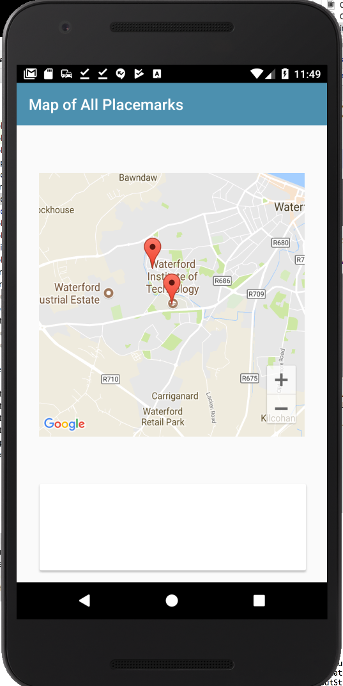

# Markers

Currently our new view looks like this:

We can start to configure the map but introducing a new method to for this purpose:

## PlacemarkMapsActivity
~~~
  fun configureMap() {
    map.uiSettings.setZoomControlsEnabled(true)
  }
~~~

To call this method, we need to first initialize the map object - and then call configureMap()

## PlacemarkMapsActivity
~~~
  override fun onCreate(savedInstanceState: Bundle?) {
    super.onCreate(savedInstanceState)
    setContentView(R.layout.activity_placemark_maps)
    setSupportActionBar(toolbarMaps)
    mapView.onCreate(savedInstanceState);
    mapView.getMapAsync {
      map = it
      configureMap()
    }
  }
~~~

Note carefully the last three lines above - we are asking the MapView for the actual googleMap object (called `it` in this shorthand above). We then store `it` in the `map` property of the class.

Running the app - you should see new zoom controls:

Now bring in a reference to the `MainApp` object into the class

## PlacemarkMapsActivity
~~~
class PlacemarkMapsActivity : AppCompatActivity() {
  ...
  lateinit var app: MainApp

  override fun onCreate(savedInstanceState: Bundle?) {
    ...
    app = application as MainApp
    ...
  }
~~~

Notice it is also initialize above in the usual manner.

Now rework condigureMap to iterate through all of the placemarks (fetched from the store) and add a marker at the location of each of them.

~~~
  fun configureMap() {
    map.uiSettings.setZoomControlsEnabled(true)
    app.placemarks.findAll().forEach {
      val loc = LatLng(it.lat, it.lng)
      val options = MarkerOptions().title(it.title).position(loc)
      map.addMarker(options).tag = it.id
    }
  }
~~~

Run the app now and create a few placemarks in different locations. Then display this activity - we expect to see markers in the correct locations (we may need to zoom in to see them).

If we add the following to the loop:

~~~
        map.moveCamera(CameraUpdateFactory.newLatLngZoom(loc, it.zoom))
~~~

Then the app should zoom in to the last placemark:

This is the complete configureMap method at this stage:

~~~
  fun configureMap() {
    map.uiSettings.setZoomControlsEnabled(true)
    app.placemarks.findAll().forEach {
      val loc = LatLng(it.lat, it.lng)
      val options = MarkerOptions().title(it.title).position(loc)
      map.addMarker(options).tag = it.id
      map.moveCamera(CameraUpdateFactory.newLatLngZoom(loc, it.zoom))
    }
  }
~~~

  
