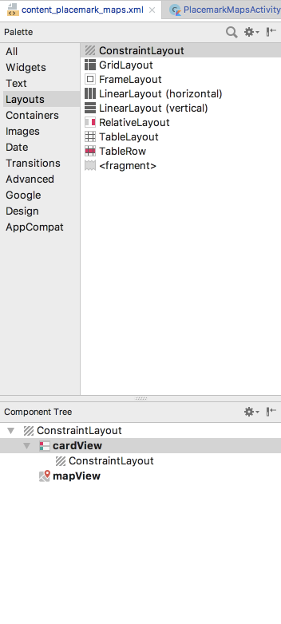
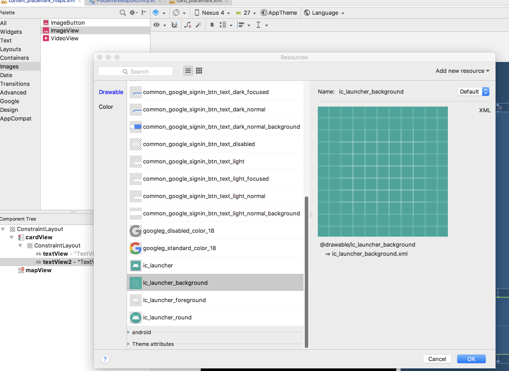
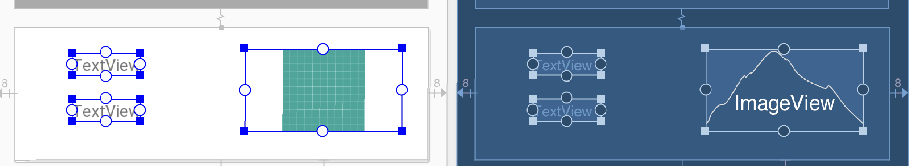
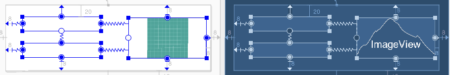

# CardView

We already have a CardView in place. We now start to work inside it. First, install a ConstraintLayout inside the Card:

Then, insert an ImageView:

and 2 TextViews into the card:

Call the TextViews `currentTitle` and `currentDescription` respectively.

Anchor them as shown below:

This is the complete layout at this stage:

~~~
<?xml version="1.0" encoding="utf-8"?>
<android.support.constraint.ConstraintLayout xmlns:android="http://schemas.android.com/apk/res/android"
  xmlns:app="http://schemas.android.com/apk/res-auto"
  xmlns:tools="http://schemas.android.com/tools"
  android:layout_width="match_parent"
  android:layout_height="match_parent"
  app:layout_behavior="@string/appbar_scrolling_view_behavior"
  tools:context="org.wit.placemark.activities.PlacemarkMapsActivity"
  tools:showIn="@layout/activity_placemark_maps">

  <android.support.v7.widget.CardView
    android:id="@+id/cardView"
    android:layout_width="353dp"
    android:layout_height="114dp"
    android:layout_marginBottom="16dp"
    android:layout_marginEnd="8dp"
    android:layout_marginStart="8dp"
    app:layout_constraintBottom_toBottomOf="parent"
    app:layout_constraintEnd_toEndOf="parent"
    app:layout_constraintHorizontal_bias="0.533"
    app:layout_constraintStart_toStartOf="parent" >

    <android.support.constraint.ConstraintLayout
      android:layout_width="match_parent"
      android:layout_height="match_parent">

      <TextView
        android:id="@+id/currentTitle"
        android:layout_width="135dp"
        android:layout_height="25dp"
        android:layout_marginEnd="8dp"
        android:layout_marginStart="8dp"
        android:layout_marginTop="20dp"
        app:layout_constraintEnd_toStartOf="@+id/imageView"
        app:layout_constraintHorizontal_bias="0.35"
        app:layout_constraintStart_toStartOf="parent"
        app:layout_constraintTop_toTopOf="parent" />

      <TextView
        android:id="@+id/currentDescription"
        android:layout_width="135dp"
        android:layout_height="25dp"
        android:layout_marginBottom="8dp"
        android:layout_marginEnd="8dp"
        android:layout_marginStart="8dp"
        android:layout_marginTop="8dp"
        app:layout_constraintBottom_toBottomOf="parent"
        app:layout_constraintEnd_toStartOf="@+id/imageView"
        app:layout_constraintHorizontal_bias="0.35"
        app:layout_constraintStart_toStartOf="parent"
        app:layout_constraintTop_toBottomOf="@+id/currentTitle"
        app:layout_constraintVertical_bias="0.425" />

      <ImageView
        android:id="@+id/imageView"
        android:layout_width="134dp"
        android:layout_height="70dp"
        android:layout_marginBottom="8dp"
        android:layout_marginEnd="8dp"
        android:layout_marginTop="8dp"
        app:layout_constraintBottom_toBottomOf="parent"
        app:layout_constraintEnd_toEndOf="parent"
        app:layout_constraintTop_toTopOf="parent"
        app:srcCompat="@drawable/ic_launcher_background" />
    </android.support.constraint.ConstraintLayout>
  </android.support.v7.widget.CardView>

  <com.google.android.gms.maps.MapView
    android:id="@+id/mapView"
    android:layout_width="352dp"
    android:layout_height="348dp"
    android:layout_marginBottom="8dp"
    android:layout_marginEnd="8dp"
    android:layout_marginStart="8dp"
    android:layout_marginTop="8dp"
    app:layout_constraintBottom_toTopOf="@+id/cardView"
    app:layout_constraintEnd_toEndOf="parent"
    app:layout_constraintStart_toStartOf="parent"
    app:layout_constraintTop_toTopOf="parent" />
</android.support.constraint.ConstraintLayout>
~~~

