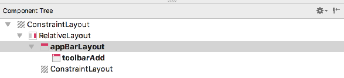

# Exercise Solution

## Exercise 1

Currently the PlacemarkActivity layout is hand coded - and is not using the ConstraintLayout. The screen shots below are taken from a refactor the view to make it fully based on the ConstraintLayout. All of this refactoring is carried out using the visual tools.

## Solution

You could start by removing everything - and lust leaving the toolbar + a (new) ConstraintLayout

## activity_placemark.xml

~~~
<?xml version="1.0" encoding="utf-8"?>
<android.support.constraint.ConstraintLayout
    xmlns:android="http://schemas.android.com/apk/res/android"
    xmlns:app="http://schemas.android.com/apk/res-auto"
    xmlns:tools="http://schemas.android.com/tools"
    android:layout_width="match_parent"
    android:layout_height="match_parent"
    tools:context="org.wit.placemark.activities.PlacemarkActivity">

  <RelativeLayout
      android:layout_width="match_parent"
      android:layout_height="wrap_content">

    <android.support.design.widget.AppBarLayout
      android:id="@+id/appBarLayout"
      android:layout_width="match_parent"
      android:layout_height="wrap_content"
      android:background="@color/colorAccent"
      android:fitsSystemWindows="true"
      app:elevation="0dip"
      app:theme="@style/ThemeOverlay.AppCompat.Dark.ActionBar">

      <android.support.v7.widget.Toolbar
        android:id="@+id/toolbarAdd"
        android:layout_width="match_parent"
        android:layout_height="wrap_content"
        app:titleTextColor="@color/colorPrimary" />
    </android.support.design.widget.AppBarLayout>

    <android.support.constraint.ConstraintLayout
      android:layout_width="match_parent"
      android:layout_height="match_parent">

    </android.support.constraint.ConstraintLayout>

  </RelativeLayout>
</android.support.constraint.ConstraintLayout>
~~~

The recreate all of the controls:

~~~
<?xml version="1.0" encoding="utf-8"?>
<android.support.constraint.ConstraintLayout
    xmlns:android="http://schemas.android.com/apk/res/android"
    xmlns:app="http://schemas.android.com/apk/res-auto"
    xmlns:tools="http://schemas.android.com/tools"
    android:layout_width="match_parent"
    android:layout_height="match_parent"
    tools:context="org.wit.placemark.activities.PlacemarkActivity">

  <RelativeLayout
      android:layout_width="match_parent"
      android:layout_height="wrap_content">

    <android.support.design.widget.AppBarLayout
      android:id="@+id/appBarLayout"
      android:layout_width="match_parent"
      android:layout_height="wrap_content"
      android:background="@color/colorAccent"
      android:fitsSystemWindows="true"
      app:elevation="0dip"
      app:theme="@style/ThemeOverlay.AppCompat.Dark.ActionBar">

      <android.support.v7.widget.Toolbar
        android:id="@+id/toolbarAdd"
        android:layout_width="match_parent"
        android:layout_height="wrap_content"
        app:titleTextColor="@color/colorPrimary" />
    </android.support.design.widget.AppBarLayout>

    <android.support.constraint.ConstraintLayout
      android:layout_width="match_parent"
      android:layout_height="match_parent">

      <EditText
        android:id="@+id/placemarkTitle"
        android:layout_width="wrap_content"
        android:layout_height="wrap_content"
        android:ems="10"
        android:hint="@string/hint_placemarkTitle"
        android:inputType="text"
        tools:layout_editor_absoluteX="48dp"
        tools:layout_editor_absoluteY="89dp" />

      <EditText
        android:id="@+id/description"
        android:layout_width="wrap_content"
        android:layout_height="wrap_content"
        android:ems="10"
        android:hint="@string/hint_placemarkDescription"
        android:inputType="textPersonName"
        tools:layout_editor_absoluteX="55dp"
        tools:layout_editor_absoluteY="165dp" />

      <Button
        android:id="@+id/chooseImage"
        android:layout_width="wrap_content"
        android:layout_height="wrap_content"
        android:text="@string/button_addImage"
        tools:layout_editor_absoluteX="270dp"
        tools:layout_editor_absoluteY="301dp" />

      <ImageView
        android:id="@+id/placemarkImage"
        android:layout_width="wrap_content"
        android:layout_height="wrap_content"
        app:srcCompat="@drawable/ic_launcher_background"
        tools:layout_editor_absoluteX="260dp"
        tools:layout_editor_absoluteY="443dp" />

      <Button
        android:id="@+id/placemarkLocation"
        android:layout_width="wrap_content"
        android:layout_height="wrap_content"
        android:text="@string/button_location"
        tools:layout_editor_absoluteX="64dp"
        tools:layout_editor_absoluteY="284dp" />

      <Button
        android:id="@+id/btnAdd"
        android:layout_width="wrap_content"
        android:layout_height="wrap_content"
        android:text="@string/button_addPlacemark"
        tools:layout_editor_absoluteX="48dp"
        tools:layout_editor_absoluteY="417dp" />
    </android.support.constraint.ConstraintLayout>

  </RelativeLayout>
</android.support.constraint.ConstraintLayout>
~~~

And finally, wire them together to achieve this layout:

~~~
<?xml version="1.0" encoding="utf-8"?>
<android.support.constraint.ConstraintLayout
  xmlns:android="http://schemas.android.com/apk/res/android"
  xmlns:app="http://schemas.android.com/apk/res-auto"
  xmlns:tools="http://schemas.android.com/tools"
  android:layout_width="match_parent"
  android:layout_height="match_parent"
  tools:context="org.wit.placemark.activities.PlacemarkActivity">

  <android.support.design.widget.AppBarLayout
    android:id="@+id/appBarLayout"
    android:layout_width="match_parent"
    android:layout_height="wrap_content"
    android:background="@color/colorAccent"
    android:fitsSystemWindows="true"
    app:elevation="0dip"
    app:theme="@style/ThemeOverlay.AppCompat.Dark.ActionBar">

    <android.support.v7.widget.Toolbar
      android:id="@+id/toolbarAdd"
      android:layout_width="match_parent"
      android:layout_height="wrap_content"
      app:titleTextColor="@color/colorPrimary" />

  </android.support.design.widget.AppBarLayout>

  <android.support.constraint.ConstraintLayout
    android:layout_width="match_parent"
    android:layout_height="600dp"
    android:layout_marginEnd="8dp"
    android:layout_marginStart="8dp"
    app:layout_constraintEnd_toEndOf="parent"
    app:layout_constraintStart_toStartOf="parent"
    app:layout_constraintTop_toTopOf="parent">

    <EditText
      android:id="@+id/placemarkTitle"
      android:layout_width="365dp"
      android:layout_height="wrap_content"
      android:layout_marginEnd="8dp"
      android:layout_marginStart="8dp"
      android:layout_marginTop="64dp"
      android:ems="10"
      android:hint="@string/hint_placemarkTitle"
      android:inputType="text"
      app:layout_constraintEnd_toEndOf="parent"
      app:layout_constraintHorizontal_bias="0.503"
      app:layout_constraintStart_toStartOf="parent"
      app:layout_constraintTop_toTopOf="parent" />

    <EditText
      android:id="@+id/description"
      android:layout_width="365dp"
      android:layout_height="wrap_content"
      android:layout_marginEnd="8dp"
      android:layout_marginStart="8dp"
      android:layout_marginTop="8dp"
      android:ems="10"
      android:hint="@string/hint_placemarkDescription"
      android:inputType="textPersonName"
      app:layout_constraintEnd_toEndOf="parent"
      app:layout_constraintStart_toStartOf="parent"
      app:layout_constraintTop_toBottomOf="@+id/placemarkTitle" />

    <Button
      android:id="@+id/btnAdd"
      android:layout_width="365dp"
      android:layout_height="wrap_content"
      android:layout_marginEnd="8dp"
      android:layout_marginStart="8dp"
      android:text="@string/button_addPlacemark"
      app:layout_constraintEnd_toEndOf="parent"
      app:layout_constraintStart_toStartOf="parent"
      app:layout_constraintTop_toBottomOf="@+id/description" />

    <Button
      android:id="@+id/chooseImage"
      android:layout_width="150dp"
      android:layout_height="wrap_content"
      android:layout_marginTop="8dp"
      android:text="@string/button_addImage"
      app:layout_constraintStart_toStartOf="@+id/btnAdd"
      app:layout_constraintTop_toBottomOf="@+id/btnAdd" />

    <Button
      android:id="@+id/placemarkLocation"
      android:layout_width="150dp"
      android:layout_height="wrap_content"
      android:layout_marginEnd="8dp"
      android:layout_marginStart="8dp"
      android:layout_marginTop="8dp"
      android:text="@string/button_location"
      app:layout_constraintEnd_toEndOf="@+id/btnAdd"
      app:layout_constraintHorizontal_bias="1.0"
      app:layout_constraintStart_toEndOf="@+id/chooseImage"
      app:layout_constraintTop_toBottomOf="@+id/btnAdd" />

    <ImageView
      android:id="@+id/placemarkImage"
      android:layout_width="0dp"
      android:layout_height="0dp"
      android:layout_marginStart="8dp"
      android:layout_marginTop="8dp"
      android:layout_marginEnd="8dp"
      android:layout_marginBottom="8dp"
      app:layout_constraintBottom_toBottomOf="parent"
      app:layout_constraintEnd_toEndOf="parent"
      app:layout_constraintHorizontal_bias="0.555"
      app:layout_constraintStart_toStartOf="parent"
      app:layout_constraintTop_toBottomOf="@+id/placemarkLocation"
      app:layout_constraintVertical_bias="0.173"
      app:srcCompat="@drawable/ic_launcher_background" />

  </android.support.constraint.ConstraintLayout>

</android.support.constraint.ConstraintLayout>
~~~

Take a look at the imageView in the inspector -

.. and note the 'match constraints' setting in the image guides.

Running the app - the screen should look like this:

## content_placeark_maps.xml

Finally, some small adjustments to the Map control in the PlacemarkMapsActivity:

~~~
  <com.google.android.gms.maps.MapView
    android:id="@+id/mapView"
    android:layout_width="0dp"
    android:layout_height="0dp"
    android:layout_marginStart="8dp"
    android:layout_marginTop="8dp"
    android:layout_marginEnd="8dp"
    android:layout_marginBottom="8dp"
    app:layout_constraintBottom_toTopOf="@+id/cardView"
    app:layout_constraintEnd_toEndOf="parent"
    app:layout_constraintStart_toStartOf="parent"
    app:layout_constraintTop_toTopOf="parent" />
~~~

These adjustments are made via the attribute inspector again:

