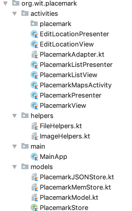
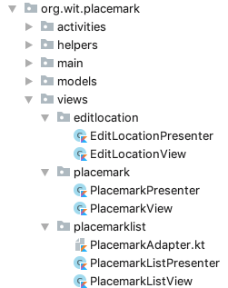

## Rename & Refactor

We might take this opportunity to tidy up some of the names we have been using

## 1: MapsActivity/MapsPresenter

This class has a poor name choice, as it conflicts somewhat with one of our other activities.

- Rename MapsActivity to EditLoctionActivity
- Rename MapsPresenter to EditLocationPresenter

Be sure to use the refactoring tools to do this. In particular, make sure that the various resources to refer to the activity class are appropriately updated.

A good way of doing this is to keep an eye on the git changes once the refactoring is complete.

Do not proceed until you have completed a complete rebuild and also test of the application.

## 2: Rename all `Activities` to `Views`

As we are now using the MVP pattern - it would be a good idea to adjust our class naming to reveal this.

- Rename all XxxxActivity classes to ViewActivity
- Rename all `activity` references in the Presenters to `view`

So we would have `PlacemarkView` and `PlacemarkPresenter`, with the `activity` property in PlacemarkPresenter renamed to `view`:

~~~
...
class PlacemarkPresenter(val view: PlacemarkView) {
...
~~~

Again, try to use the refactoring tools to do this.

## Refactor package structure

Finally, this is our current package structure:

Have a look at this revised version:

Notice that we have created a `views` packages - and then this contains a package for each view/presenter pair.

See if you can replicate this now in your project.