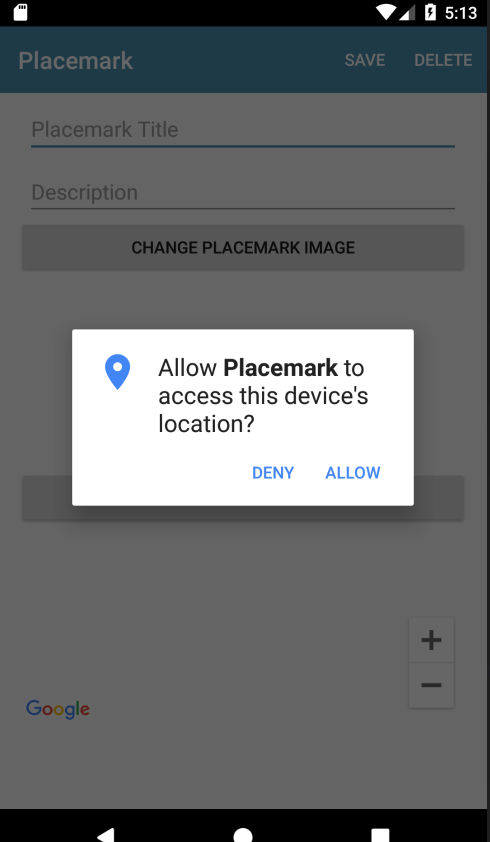

# Location Permissions

If we wish to access the devices current location, we will need to prompt the user to grant this permission - and be able to proceed in an orderly manner if this permission is denied.

First, in the presenter, acquire a reference to the location provider client:

~~~
  var locationService: FusedLocationProviderClient = LocationServices.getFusedLocationProviderClient(view)
~~~

Th init block is modified to check to see if permission is requires (or already has been granted):

~~~
  init {
    if (view.intent.hasExtra("placemark_edit")) {
      edit = true
      placemark = view.intent.extras.getParcelable<PlacemarkModel>("placemark_edit")
      view.showPlacemark(placemark)
    } else {
      if (checkLocationPermissions(view)) {
        // todo get the current location
      }
    }
  }
~~~

This method will be called with the users response to the permissions dialog:

~~~
  override fun doRequestPermissionsResult(requestCode: Int, permissions: Array<String>, grantResults: IntArray) {
    if (isPermissionGranted(requestCode, grantResults)) {
      // todo get the current location
    } else {
      // permissions denied, so use the default location
      locationUpdate(defaultLocation.lat, defaultLocation.lng)
    }
  }
~~~

Run the application now - when you create a new placemark you should see this dialog:

Close the app and run it again. Does the dialog appear? (it doesnt).

Now, close the app and delete from the phone. Rerun - and the dialog will reappear. Android is persisting the permission request/response, only displaying once.

This is the presenter at this stage (we still are not acquiring the current location)

## PlacemarkPresenter

~~~
package org.wit.placemark.views.placemark

import android.annotation.SuppressLint
import android.content.Intent
import com.google.android.gms.location.FusedLocationProviderClient
import com.google.android.gms.location.LocationServices
import com.google.android.gms.maps.CameraUpdateFactory
import com.google.android.gms.maps.GoogleMap
import com.google.android.gms.maps.model.LatLng
import com.google.android.gms.maps.model.MarkerOptions
import kotlinx.android.synthetic.main.activity_maps.*
import org.wit.placemark.helpers.checkLocationPermissions
import org.wit.placemark.helpers.isPermissionGranted
import org.wit.placemark.helpers.showImagePicker
import org.wit.placemark.models.Location
import org.wit.placemark.models.PlacemarkModel
import org.wit.placemark.views.*

class PlacemarkPresenter(view: BaseView) : BasePresenter(view) {

  var map: GoogleMap? = null
  var locationService: FusedLocationProviderClient = LocationServices.getFusedLocationProviderClient(view)

  var placemark = PlacemarkModel()
  var defaultLocation = Location(52.245696, -7.139102, 15f)
  var edit = false;

  init {
    if (view.intent.hasExtra("placemark_edit")) {
      edit = true
      placemark = view.intent.extras.getParcelable<PlacemarkModel>("placemark_edit")
      view.showPlacemark(placemark)
    } else {
      if (checkLocationPermissions(view)) {
        // todo get the current location
      }
    }
  }

  fun doConfigureMap(m: GoogleMap) {
    map = m
    locationUpdate(placemark.lat, placemark.lng)
  }

  fun locationUpdate(lat: Double, lng: Double) {
    placemark.lat = lat
    placemark.lng = lng
    placemark.zoom = 15f
    map?.clear()
    map?.uiSettings?.setZoomControlsEnabled(true)
    val options = MarkerOptions().title(placemark.title).position(LatLng(placemark.lat, placemark.lng))
    map?.addMarker(options)
    map?.moveCamera(CameraUpdateFactory.newLatLngZoom(LatLng(placemark.lat, placemark.lng), placemark.zoom))
    view?.showPlacemark(placemark)
  }

  override fun doRequestPermissionsResult(requestCode: Int, permissions: Array<String>, grantResults: IntArray) {
    if (isPermissionGranted(requestCode, grantResults)) {
      // todo get the current location
    } else {
      // permissions denied, so use the default location
      locationUpdate(defaultLocation.lat, defaultLocation.lng)
    }
  }

  fun doAddOrSave(title: String, description: String) {
    placemark.title = title
    placemark.description = description
    if (edit) {
      app.placemarks.update(placemark)
    } else {
      app.placemarks.create(placemark)
    }
    view?.finish()
  }

  fun doCancel() {
    view?.finish()
  }

  fun doDelete() {
    app.placemarks.delete(placemark)
    view?.finish()
  }

  fun doSelectImage() {
    view?.let {
      showImagePicker(view!!, IMAGE_REQUEST)
    }
  }

  fun doSetLocation() {
    if (edit == false) {
      view?.navigateTo(VIEW.LOCATION, LOCATION_REQUEST, "location", defaultLocation)
    } else {
      view?.navigateTo(VIEW.LOCATION, LOCATION_REQUEST, "location", Location(placemark.lat, placemark.lng, placemark.zoom))
    }
  }

  override fun doActivityResult(requestCode: Int, resultCode: Int, data: Intent) {
    when (requestCode) {
      IMAGE_REQUEST -> {
        placemark.image = data.data.toString()
        view?.showPlacemark(placemark)
      }
      LOCATION_REQUEST -> {
        val location = data.extras.getParcelable<Location>("location")
        placemark.lat = location.lat
        placemark.lng = location.lng
        placemark.zoom = location.zoom
        locationUpdate(placemark.lat, placemark.lng)
      }
    }
  }
}
~~~

