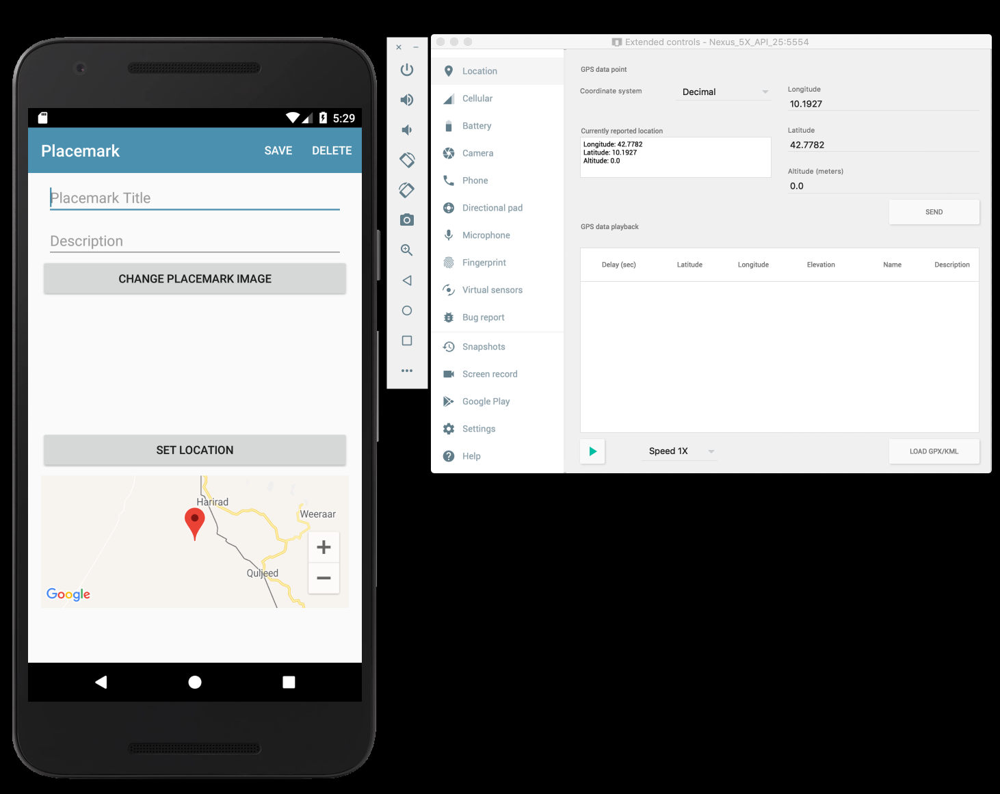

# Requesting the Current Location

Introduce this new method into the presenter:

~~~
  @SuppressLint("MissingPermission")
  fun doSetCurrentLocation() {
    locationService.lastLocation.addOnSuccessListener {
      locationUpdate(it.latitude, it.longitude)
    }
  }
~~~

In the init block, we can now call this method:

~~~
      if (checkLocationPermissions(view)) {
        doSetCurrentLocation()
      }
~~~

Finally, we can complete the permissions response:

~~~
  override fun doRequestPermissionsResult(requestCode: Int, permissions: Array<String>, grantResults: IntArray) {
    if (isPermissionGranted(requestCode, grantResults)) {
      doSetCurrentLocation()
    } else {
      locationUpdate(defaultLocation.lat, defaultLocation.lng)
    }
  }
~~~

Also, our doSetLocation can be simplified:

~~~
  fun doSetLocation() {
    view?.navigateTo(VIEW.LOCATION, LOCATION_REQUEST, "location", Location(placemark.lat, placemark.lng, placemark.zoom))
  }
~~~

Testing this in the emulator, you do have the ability to set the simulator location:

However, if you change the location it might take a few minutes before it percolates into the location provider.

This is the complete Presenter at this stage:

~~~
package org.wit.placemark.views.placemark

import android.annotation.SuppressLint
import android.content.Intent
import com.google.android.gms.location.FusedLocationProviderClient
import com.google.android.gms.location.LocationServices
import com.google.android.gms.maps.CameraUpdateFactory
import com.google.android.gms.maps.GoogleMap
import com.google.android.gms.maps.model.LatLng
import com.google.android.gms.maps.model.MarkerOptions
import org.wit.placemark.helpers.checkLocationPermissions
import org.wit.placemark.helpers.isPermissionGranted
import org.wit.placemark.helpers.showImagePicker
import org.wit.placemark.models.Location
import org.wit.placemark.models.PlacemarkModel
import org.wit.placemark.views.*

class PlacemarkPresenter(view: BaseView) : BasePresenter(view) {

  var map: GoogleMap? = null
  var placemark = PlacemarkModel()
  var defaultLocation = Location(52.245696, -7.139102, 15f)
  var edit = false;
  var locationService: FusedLocationProviderClient = LocationServices.getFusedLocationProviderClient(view)

  init {
    if (view.intent.hasExtra("placemark_edit")) {
      edit = true
      placemark = view.intent.extras.getParcelable<PlacemarkModel>("placemark_edit")
      view.showPlacemark(placemark)
    } else {
      if (checkLocationPermissions(view)) {
        doSetCurrentLocation()
      }
    }
  }

  @SuppressLint("MissingPermission")
  fun doSetCurrentLocation() {
    locationService.lastLocation.addOnSuccessListener {
      locationUpdate(it.latitude, it.longitude)
    }
  }

  override fun doRequestPermissionsResult(requestCode: Int, permissions: Array<String>, grantResults: IntArray) {
    if (isPermissionGranted(requestCode, grantResults)) {
      doSetCurrentLocation()
    } else {
      locationUpdate(defaultLocation.lat, defaultLocation.lng)
    }
  }

  fun doConfigureMap(m: GoogleMap) {
    map = m
    locationUpdate(placemark.lat, placemark.lng)
  }

  fun locationUpdate(lat: Double, lng: Double) {
    placemark.lat = lat
    placemark.lng = lng
    placemark.zoom = 15f
    map?.clear()
    map?.uiSettings?.setZoomControlsEnabled(true)
    val options = MarkerOptions().title(placemark.title).position(LatLng(placemark.lat, placemark.lng))
    map?.addMarker(options)
    map?.moveCamera(CameraUpdateFactory.newLatLngZoom(LatLng(placemark.lat, placemark.lng), placemark.zoom))
    view?.showPlacemark(placemark)
  }

  fun doAddOrSave(title: String, description: String) {
    placemark.title = title
    placemark.description = description
    if (edit) {
      app.placemarks.update(placemark)
    } else {
      app.placemarks.create(placemark)
    }
    view?.finish()
  }

  fun doCancel() {
    view?.finish()
  }

  fun doDelete() {
    app.placemarks.delete(placemark)
    view?.finish()
  }

  fun doSelectImage() {
    view?.let {
      showImagePicker(view!!, IMAGE_REQUEST)
    }
  }

  fun doSetLocation() {
    view?.navigateTo(VIEW.LOCATION, LOCATION_REQUEST, "location", Location(placemark.lat, placemark.lng, placemark.zoom))
  }

  override fun doActivityResult(requestCode: Int, resultCode: Int, data: Intent) {
    when (requestCode) {
      IMAGE_REQUEST -> {
        placemark.image = data.data.toString()
        view?.showPlacemark(placemark)
      }
      LOCATION_REQUEST -> {
        val location = data.extras.getParcelable<Location>("location")
        placemark.lat = location.lat
        placemark.lng = location.lng
        placemark.zoom = location.zoom
        locationUpdate(placemark.lat, placemark.lng)
      }
    }
  }
}
~~~  