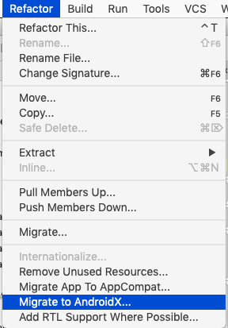

# AndroidX Migration

AndroidX is a rationalisation of many of the libraries we are using 

- <https://developer.android.com/jetpack/androidx/>

This is part of an overall repackaging of the Android SDK called 'JetPack'

- <https://developer.android.com/jetpack/>

In AndroidX, version numbers are reset and many of the package names/name spaces are reset to androidx.

Studio has a tool to automatically trigger this migration:

Try this now. THis will have changed the following gradle entries:

~~~
  implementation 'androidx.appcompat:appcompat:1.0.2'
  implementation 'androidx.constraintlayout:constraintlayout:2.0.0-alpha2'
  implementation 'androidx.cardview:cardview:1.0.0'
  androidTestImplementation 'androidx.test:runner:1.1.0'
  androidTestImplementation 'androidx.test.espresso:espresso-core:3.1.0'
~~~

... and these file will have have been modified by the migration:

~~~
gradle.properties
app/build.gradle
app/src/androidTest/java/org/wit/placemark/ExampleInstrumentedTest.kt
app/src/main/java/org/wit/placemark/helpers/LocationHelpers.kt
app/src/main/java/org/wit/placemark/views/BaseView.kt
app/src/main/java/org/wit/placemark/views/placemarklist/PlacemarkAdapter.kt
app/src/main/java/org/wit/placemark/views/placemarklist/PlacemarkListView.kt
app/src/main/res/layout/activity_edit_location.xml
app/src/main/res/layout/activity_placemark.xml
app/src/main/res/layout/activity_placemark_list.xml
app/src/main/res/layout/activity_placemark_map.xml
app/src/main/res/layout/card_placemark.xml
app/src/main/res/layout/content_placemark_map.xml
~~~

These are largely import signature modifications.

Rebuild now and verify that the app performs as before.