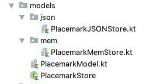

# Exercises

Placemark application so far:

- [archive.zip](archives/archive.zip)

## Exercise:

Refactor the Models package so that it is structured like this:

We will be introducing a new package here in the next lab