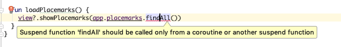

# suspend

Android will not permit access to the database on the main UI thread - as it can seriously degrade performance. 

Qhen working with Kotlin we have considerable convenience methods available via the anko libraries when attempting multi-threaded development in Android:

- <https://github.com/Kotlin/anko/wiki/Anko-Coroutines>
- <https://antonioleiva.com/anko-background-kotlin-android>

Before brining these features in your our application, we make some changes to the way we have defined the PlacemarkMemStore interface:

## PlacemarkStore

~~~
interface PlacemarkStore {
  suspend fun findAll(): List<PlacemarkModel>
  suspend fun findById(id:Long) : PlacemarkModel?
  suspend fun create(placemark: PlacemarkModel)
  suspend fun update(placemark: PlacemarkModel)
  suspend fun delete(placemark: PlacemarkModel)
}
~~~

Each method is marked with the keyword `suspend`. To get an initial understanding of the purpose of this keyword, read this (5 min):

- <https://medium.com/@elye.project/understanding-suspend-function-of-coroutines-de26b070c5ed>

In addition, look at this article (7 mins):

- <https://android.jlelse.eu/a-first-walk-into-kotlin-coroutines-on-android-fe4a6e25f46a>

Making the above change to PlacemarkStore will break the PlacemarkMemStore and PlacemarkJSONStore implementations. Fix them now by marking all of those classes with the equivalent `suspend` marker:

~~~
  suspend override fun findAll(): MutableList<PlacemarkModel> 
  ...
  ...
  ...
~~~

Rebuild the project - all of the Model classes should build, However, there will be errors in these three presenters:

- PlacemarkPresenter
- PlacemarkListPresenter
- PlacemarkMapPresenter

This is the type of error you may see:

