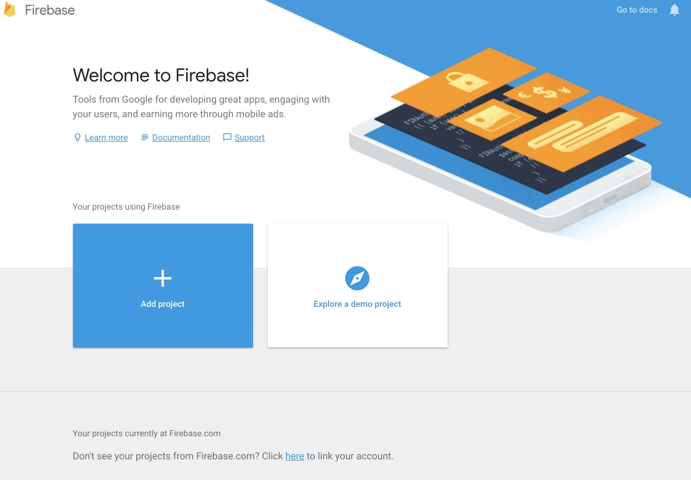

# Firebase

Visit Firebase and create / log in to your account:

- <https://firebase.google.com/>

Create a new Firebase Project:

Give the project a name:

Once the app is created - you should see the application console (click on `Develop` to see drop down menu):

Select the `Authentication` panel - 

Press `Set Sign-in Method` and in the next screen and enable `Email/Password`:

Your Authentication methods should look like this:

