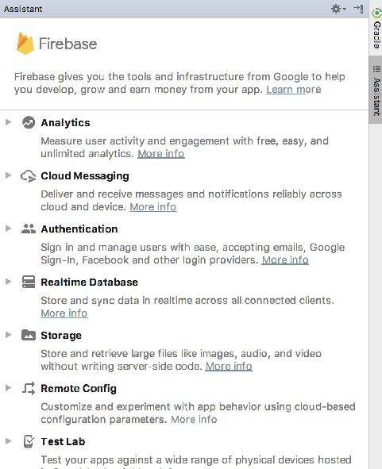

# Connect the App

Back in Android Studio, select `Tools->Firebase` - you should see the Firebase Assistant:

Select `Authentication`:

... and then select `Email and password authentication`:

Now press `Connect to Firebase`

This may require you to authenticate to firebase with your account. Once connected, you should see your firebase created app:

Select the app and press `Connect to Firebase`

This will insert a new file into your project called `google-services.json`. This file is embedded in the `app` folder. You will need to switch to the `Project` perspective in Studio in order to see it.

The assistant will also insert additional entries into both of our gradle files. The top level gradle will have this additional entry:

## build.gradle
 
~~~
    classpath 'com.google.gms:google-services:4.0.1'
~~~

The app gradle file will have additional libraries. As we are managing our gradle a little differently - we will take control of this ourselves. 

This is a revised version of the base gradle file you should use:

## project gradle

~~~
apply plugin: 'com.android.application'

apply plugin: 'kotlin-android'

apply plugin: 'kotlin-android-extensions'

apply plugin: "kotlin-kapt"

apply plugin: 'com.google.gms.google-services'

androidExtensions {
  experimental = true
}

android {
  compileSdkVersion 28
  defaultConfig {
    applicationId "org.wit.placemark"
    minSdkVersion 23
    targetSdkVersion 28
    versionCode 1
    versionName "1.0"
    testInstrumentationRunner "androidx.test.runner.AndroidJUnitRunner"
  }
  buildTypes {
    release {
      minifyEnabled false
      proguardFiles getDefaultProguardFile('proguard-android.txt'), 'proguard-rules.pro'
    }
  }
}

ext {
  app_compat_version = '1.0.2'
  constraint_layout_version = '2.0.0-alpha2'
  material_version = '1.0.0'
  cardview_version = '1.0.0'
  design_library_version = '26.1.0'
  support_library_version = '26.1.0'

  play_services_maps_version = '16.0.0'
  play_services_location_version = '16.0.0'

  anko_version = '0.10.7'
  anko_commons_version = '0.10.7'
  gson_version = '2.8.5'

  room_version = "2.0.0"
  firebase_version = '16.0.5'
}

dependencies {
  implementation fileTree(dir: 'libs', include: ['*.jar'])
  implementation "org.jetbrains.kotlin:kotlin-stdlib-jdk7:$kotlin_version"
  implementation "androidx.appcompat:appcompat:$app_compat_version"
  implementation "androidx.constraintlayout:constraintlayout:$constraint_layout_version"
  implementation "com.google.android.material:material:$material_version"
  implementation "androidx.cardview:cardview:$cardview_version"
  implementation "com.google.android.gms:play-services-maps:$play_services_maps_version"
  implementation "com.google.android.gms:play-services-location:$play_services_location_version"
  implementation "org.jetbrains.anko:anko-commons:$anko_commons_version"
  implementation "org.jetbrains.anko:anko:$anko_version"
  implementation "com.google.code.gson:gson:$gson_version"
  implementation "androidx.room:room-runtime:$room_version"
  kapt "androidx.room:room-compiler:$room_version"

  implementation "com.google.firebase:firebase-auth:$firebase_version"
  implementation "com.google.firebase:firebase-database:$firebase_version"

  testImplementation 'junit:junit:4.12'
  androidTestImplementation 'androidx.test:runner:1.1.0'
  androidTestImplementation 'androidx.test.espresso:espresso-core:3.1.0'

}
~~~

These are the new features in the project:

~~~
...
apply plugin: 'com.google.gms.google-services'
...
  firebase_version = '16.0.5'
  ...
  implementation "com.google.firebase:firebase-auth:$firebase_version"
  implementation "com.google.firebase:firebase-database:$firebase_version"
...
~~~

Rebuild the application now to make sure all of these libraries can be incorporated correctly.

## google-service.json

The Firebase wizard will also have generate a file of various credentials for your app in 

- app/app/google-services.json

Have a look at the contents of this file now. It contains multiple keys to facilitate authentication to your firebase app. You will need to exclude this from git, particularly if the repo is public:

## .gitignore

~~~
app/google-services.json
~~~

