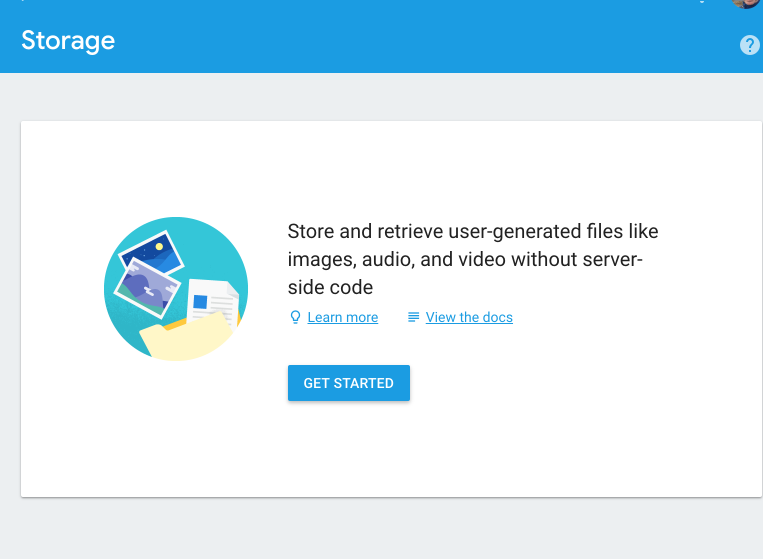
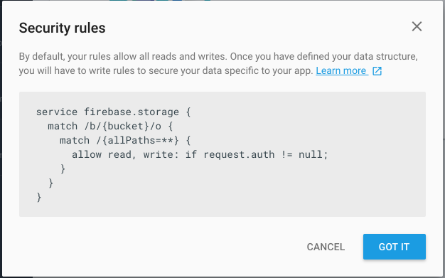
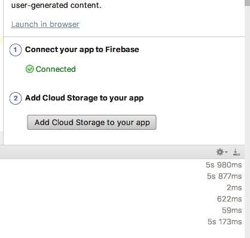

# Firebase Storage

In the Firebase Console, select `Storage`:

This gives a general purpose file storage area:

We will use this to store the placemark images.

In Studio, we now connect our app to the Firebase Storage system:

This will update an entry in the google-services.json file, connecting the app to the storeage system.
