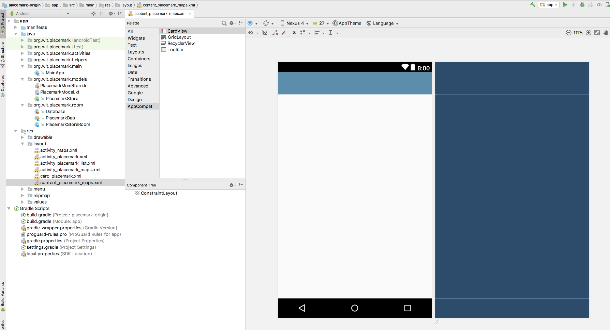
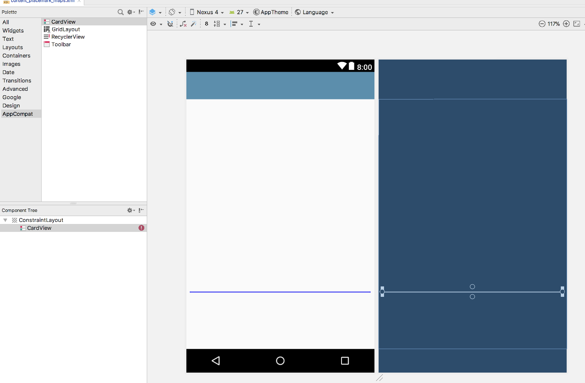
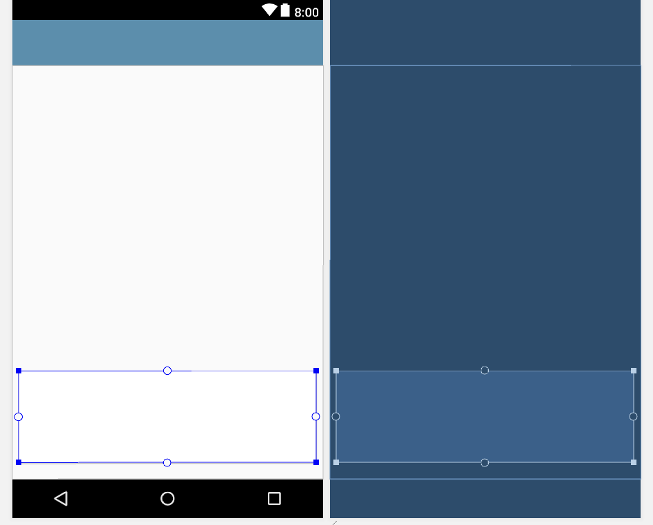
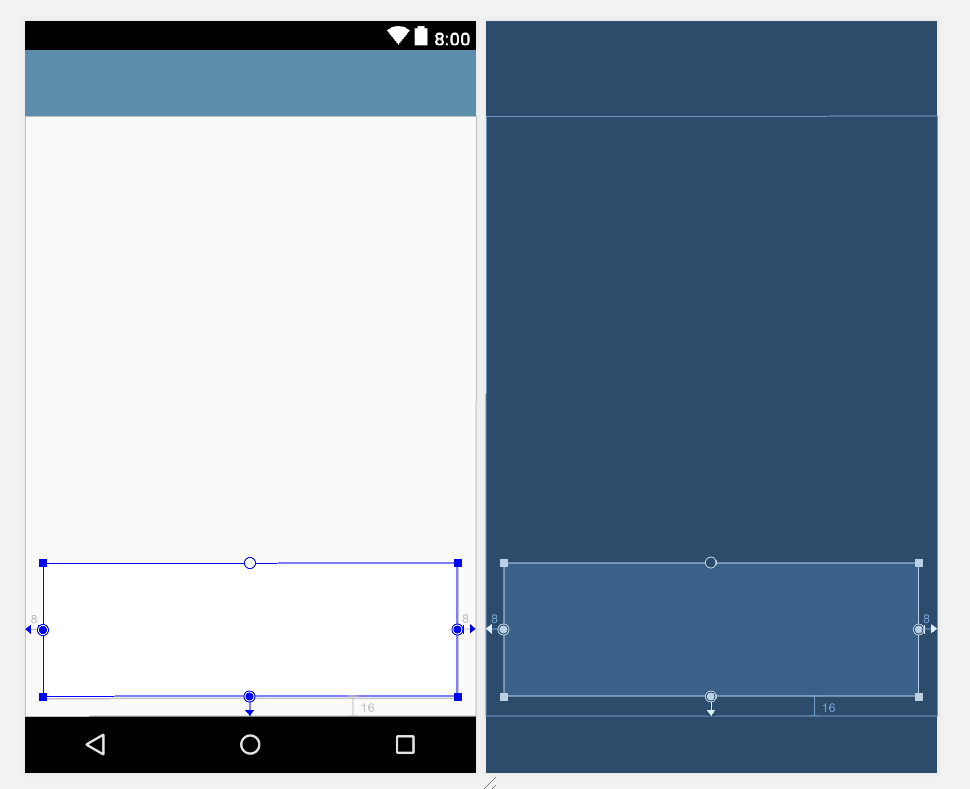
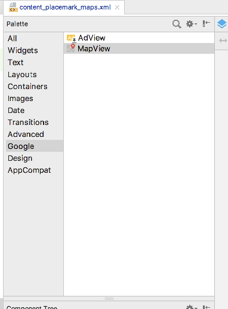
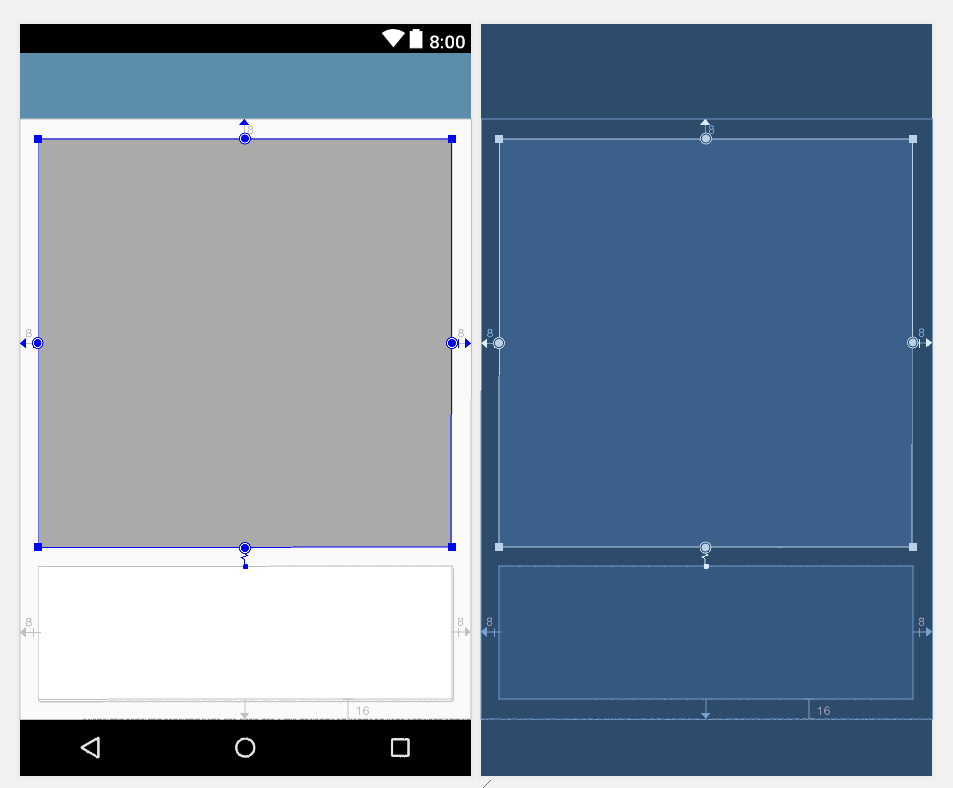
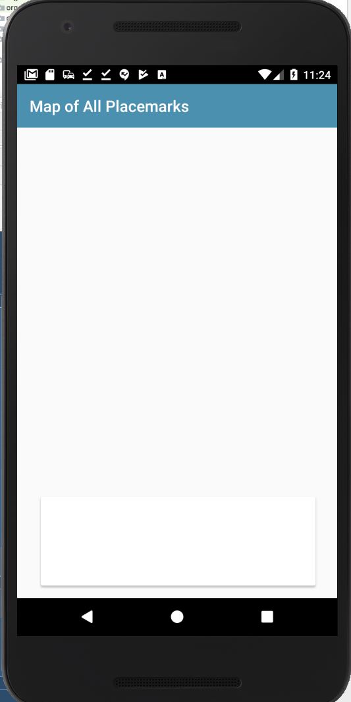
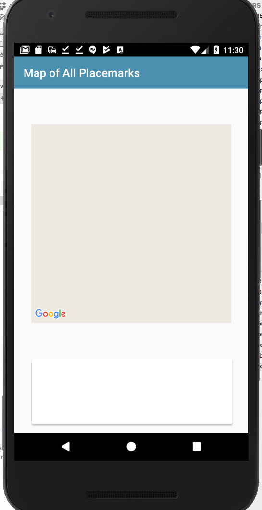
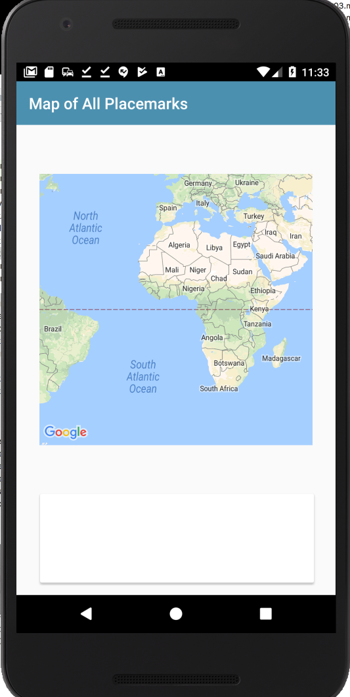

# content_placemark_maps

Notice that the wizard generated 2 layouts:

- activity_placemark_maps.xml
- content_placemark_maps

The latter is a blank canvas - based on the ConstraintLayout - which we will now use to design our view.

First - drag and drop a `CardView` component onto the canvas:

Then resize it something like this:

Then anchor three of its sides to the edge of the view:

You do this by selecting each of the circle anchor points and then clicking on the appropriate edge.

Now drag a MapView onto the canvas - and do the same anchoring procedure:

Be sure to attach the bottom of the Map to the top of the Card:

Run the app now - you should see something like this:

This is the layout at this stage:

## res/content_placemark_maps.xml

~~~
<?xml version="1.0" encoding="utf-8"?>
<android.support.constraint.ConstraintLayout xmlns:android="http://schemas.android.com/apk/res/android"
  xmlns:app="http://schemas.android.com/apk/res-auto"
  xmlns:tools="http://schemas.android.com/tools"
  android:layout_width="match_parent"
  android:layout_height="match_parent"
  app:layout_behavior="@string/appbar_scrolling_view_behavior"
  tools:context="org.wit.placemark.activities.PlacemarkMapsActivity"
  tools:showIn="@layout/activity_placemark_maps">

  <android.support.v7.widget.CardView
    android:id="@+id/cardView"
    android:layout_width="353dp"
    android:layout_height="114dp"
    android:layout_marginBottom="16dp"
    android:layout_marginEnd="8dp"
    android:layout_marginStart="8dp"
    app:layout_constraintBottom_toBottomOf="parent"
    app:layout_constraintEnd_toEndOf="parent"
    app:layout_constraintHorizontal_bias="0.533"
    app:layout_constraintStart_toStartOf="parent" />

  <com.google.android.gms.maps.MapView
    android:id="@+id/mapView"
    android:layout_width="352dp"
    android:layout_height="348dp"
    android:layout_marginBottom="8dp"
    android:layout_marginEnd="8dp"
    android:layout_marginStart="8dp"
    android:layout_marginTop="8dp"
    app:layout_constraintBottom_toTopOf="@+id/cardView"
    app:layout_constraintEnd_toEndOf="parent"
    app:layout_constraintStart_toStartOf="parent"
    app:layout_constraintTop_toTopOf="parent" />
</android.support.constraint.ConstraintLayout>
~~~

Now we can bring in a new attribute into the PlacemarkMapsActivity for the map object we just introduced:

## PlacemarkMapsActivity
~~~
package org.wit.placemark.activities

import android.os.Bundle
import android.support.v7.app.AppCompatActivity
import com.google.android.gms.maps.GoogleMap
import org.wit.placemark.R
import kotlinx.android.synthetic.main.activity_placemark_maps.*
import kotlinx.android.synthetic.main.content_placemark_maps.*

class PlacemarkMapsActivity : AppCompatActivity() {

  lateinit var map: GoogleMap

  override fun onCreate(savedInstanceState: Bundle?) {
    super.onCreate(savedInstanceState)
    setContentView(R.layout.activity_placemark_maps)
    setSupportActionBar(toolbarMaps)
    mapView.onCreate(savedInstanceState);
  }
}
~~~

Notice we are calling `mapView.onCreate`. This should now display the (empty) map:

To make the map actually render correctly - we need to rework the class so that we are passing the lifecycle events on to the map from PlacemarkMapsActivity:

## PlacemarkMapsActivity
~~~
package org.wit.placemark.activities

import android.os.Bundle
import android.support.v7.app.AppCompatActivity
import com.google.android.gms.maps.GoogleMap
import org.wit.placemark.R
import kotlinx.android.synthetic.main.activity_placemark_maps.*
import kotlinx.android.synthetic.main.content_placemark_maps.*

class PlacemarkMapsActivity : AppCompatActivity() {

  lateinit var map: GoogleMap

  override fun onCreate(savedInstanceState: Bundle?) {
    super.onCreate(savedInstanceState)
    setContentView(R.layout.activity_placemark_maps)
    setSupportActionBar(toolbarMaps)
    mapView.onCreate(savedInstanceState);
  }

  override fun onDestroy() {
    super.onDestroy()
    mapView.onDestroy()
  }

  override fun onLowMemory() {
    super.onLowMemory()
    mapView.onLowMemory()
  }

  override fun onPause() {
    super.onPause()
    mapView.onPause()
  }

  override fun onResume() {
    super.onResume()
    mapView.onResume()
  }

  override fun onSaveInstanceState(outState: Bundle?) {
    super.onSaveInstanceState(outState)
    mapView.onSaveInstanceState(outState)
  }
}
~~~

The map should now display correctly:

