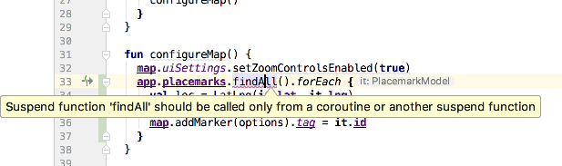
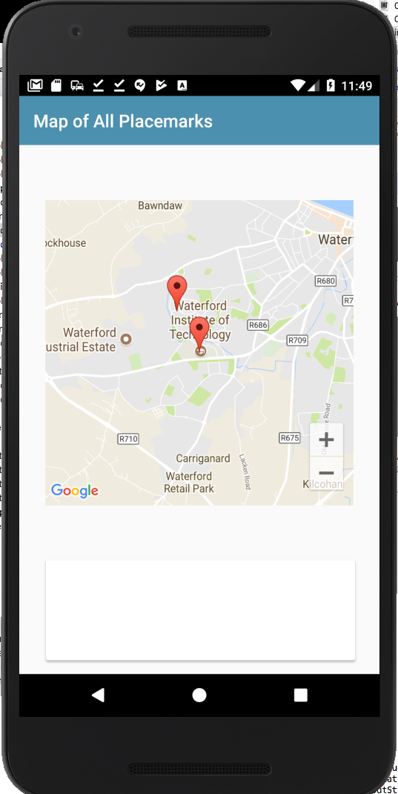

# Markers

Currently out new view looks like this:

We can start to configure the map but introducing a new method to for this purpose:

## PlacemarkMapsActivity
~~~
  fun configureMap() {
    map.uiSettings.setZoomControlsEnabled(true)
  }
~~~

To call this method, we need to first initialize the map object - and then call configureMap()

## PlacemarkMapsActivity
~~~
  override fun onCreate(savedInstanceState: Bundle?) {
    super.onCreate(savedInstanceState)
    setContentView(R.layout.activity_placemark_maps)
    setSupportActionBar(toolbarMaps)
    mapView.onCreate(savedInstanceState);
    mapView.getMapAsync {
      map = it
      configureMap()
    }
  }
~~~

Note carefully the last three lines above - we are asking the MapView for the actual googleMap object (called `it` in this shorthand above). We then store `it` in the `map` property of the class.

Running the app - you should see new zoom controls:

Now bring in a reference to the `MainApp` object into the class

## PlacemarkMapsActivity
~~~
class PlacemarkMapsActivity : AppCompatActivity() {

  lateinit var map: GoogleMap
  lateinit var app: MainApp

  override fun onCreate(savedInstanceState: Bundle?) {
    super.onCreate(savedInstanceState)
    setContentView(R.layout.activity_placemark_maps)
    setSupportActionBar(toolbarMaps)
    app = application as MainApp
    
    mapView.onCreate(savedInstanceState);
    mapView.getMapAsync {
      map = it
      configureMap()
    }
  }
~~~

Notice it is also initialize above in the same manner as before.

Now rework condigureMap to iterate through all of the placemarks (fetched from the store) and add a marker at the location of each of them.

~~~
  fun configureMap() {
    map.uiSettings.setZoomControlsEnabled(true)
    app.placemarks.findAll().forEach {
      val loc = LatLng(it.lat, it.lng)
      val options = MarkerOptions().title(it.title).position(loc)
      map.addMarker(options).tag = it.id
    }
  }
~~~

If you enter the above code - you will get this error:

This is the same issue we had in the last lab - we cannot execute database calls on the main thread as they may consume too many resources. Here is another version:

~~~
  fun configureMap() {
    map.uiSettings.setZoomControlsEnabled(true)
    async(UI) {
      app.placemarks.findAll().forEach {
        val loc = LatLng(it.lat, it.lng)
        val options = MarkerOptions().title(it.title).position(loc)
        map.addMarker(options).tag = it.id
      }
    }
  }
~~~

The `async(UI)` call makes sure that all of the enclosed code is properly called, with any suspended functions called on the background thread.

Run the app now and it should work - although you may have to manually zoom in to the the placemarks correctly.

If we add the following to the loop:

~~~
        map.moveCamera(CameraUpdateFactory.newLatLngZoom(loc, it.zoom))
~~~

Then the app should zoom in to the last placemark:

This is the complete configureMap method:

~~~
  fun configureMap() {
    map.uiSettings.setZoomControlsEnabled(true)
    async(UI) {
      app.placemarks.findAll().forEach {
        val loc = LatLng(it.lat, it.lng)
        val options = MarkerOptions().title(it.title).position(loc)
        map.addMarker(options).tag = it.id
        map.moveCamera(CameraUpdateFactory.newLatLngZoom(loc, it.zoom))
      }
    }
  }
~~~

  
