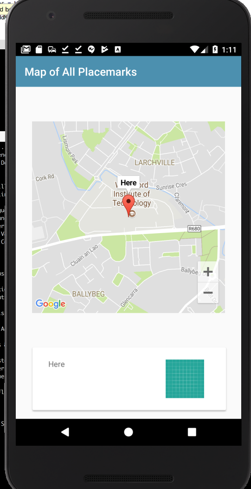

# Marker Listener

Back in the class, implement the OnMarkerListener interface:

## PlacemarkMapsActivity

~~~
class PlacemarkMapsActivity : AppCompatActivity(), GoogleMap.OnMarkerClickListener {
~~~

This is the implementation:

~~~
  override fun onMarkerClick(marker: Marker): Boolean {
    currentTitle.text = marker.title
    return false
  }
~~~

In order to receive events, you will need to register to listen for then. Here is a reworked configureMap to do this:

~~~
 fun configureMap() {
    map.uiSettings.setZoomControlsEnabled(true)
    map.setOnMarkerClickListener(this)
    async(UI) {
      app.placemarks.findAll().forEach {
        val loc = LatLng(it.lat, it.lng)
        val options = MarkerOptions().title(it.title).position(loc)
        map.addMarker(options).tag = it.id
        map.moveCamera(CameraUpdateFactory.newLatLngZoom(loc, it.zoom))
      }
    }
  }
~~~

Run the app now - and if you click on a marker, it should display its title in the card:

