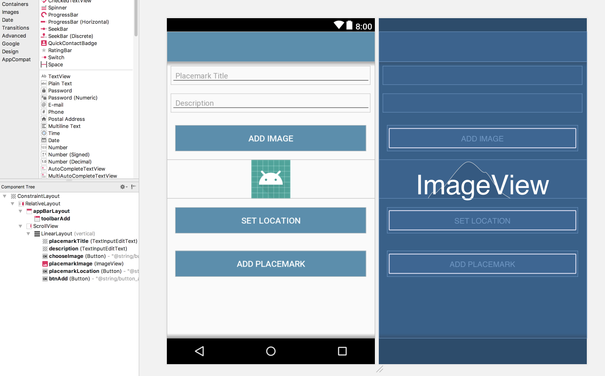
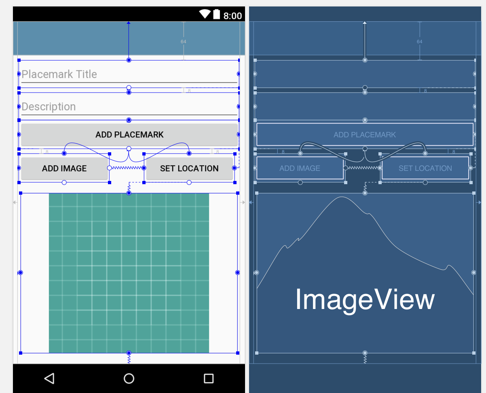
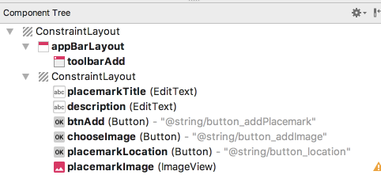

## Solution

Placemark application so far:

- [archive.zip](archives/archive.zip)

## Exercise 1

Currently the PlacemarkActivity layout is hand coded - and is not using the ConstraintLayout. The screen shots below are taken from a refactor the view to make it fully based on the ConstraintLayout. All of this refactoring is carried out using the visual tools.

See if you can replicate in your project. Keep a close eye on the CompoentTree as you work through it.

## Exercise 2

How would you go about showing the description + the image whenever a marker is selected?

This is a challenge to far at the moment, so dont spend too much time on it. We will address it on a later lab.
