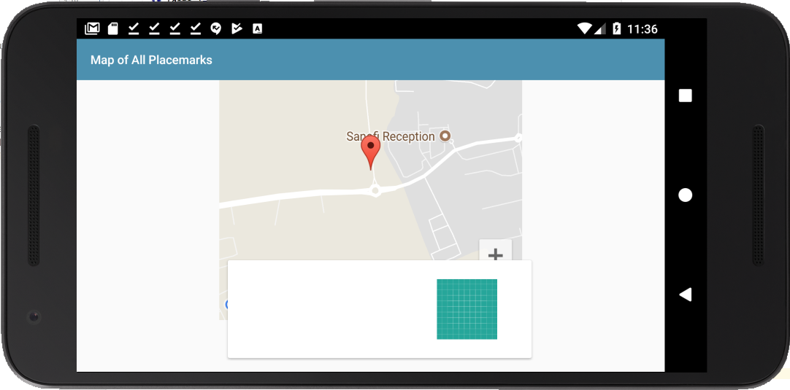
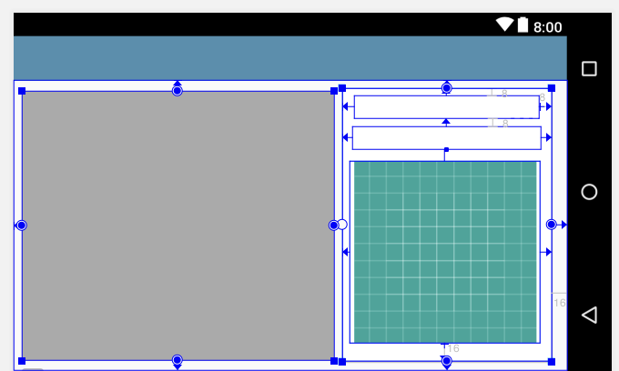

# Exercises

## Exercise 1

Create a new placemark and set its location. Save the placemark and move the location a very small distance. When you switch back to the PlacemarkActivity view, notice that you now have 2 placemarks.

## Solution

## PlacemarkActivity

Compare your version of the method below with the one shown here:

~~~
  override fun onActivityResult(requestCode: Int, resultCode: Int, data: Intent?) {
    super.onActivityResult(requestCode, resultCode, data)
    when (requestCode) {
      IMAGE_REQUEST -> {
        if (data != null) {
          placemark.image = data.getData().toString()
          placemarkImage.setImageBitmap(readImage(this, resultCode, data))
          chooseImage.setText(R.string.change_placemark_image)
        }
      }
      LOCATION_REQUEST -> {
        if (data != null) {
          val location = data.extras.getParcelable<Location>("location")
          map.clear()
          placemark.lat = location.lat
          placemark.lng = location.lng
          placemark.zoom = location.zoom
          configureMap()
        }
      }
    }
~~~

Can you see the single extra line? See if this fixes the problem.

## Exercise 2

Develop a landscape version of the PlacemarkMarkActivity:

Remember - the content of this activity is held in the `content_placemark_maps.xml`. This is included by `activity_pacemark_maps.xml`

This is the landscape layout:

## res/layout-land/content_placemark_maps.xml

~~~
<?xml version="1.0" encoding="utf-8"?>
<android.support.constraint.ConstraintLayout xmlns:android="http://schemas.android.com/apk/res/android"
  xmlns:app="http://schemas.android.com/apk/res-auto"
  xmlns:tools="http://schemas.android.com/tools"
  android:layout_width="match_parent"
  android:layout_height="match_parent"
  app:layout_behavior="@string/appbar_scrolling_view_behavior"
  tools:context="org.wit.placemark.activities.PlacemarkMapsActivity"
  tools:showIn="@layout/activity_placemark_maps">

  <android.support.v7.widget.CardView
    android:id="@+id/cardView"
    android:layout_width="224dp"
    android:layout_height="293dp"
    android:layout_marginBottom="92dp"
    android:layout_marginEnd="16dp"
    android:layout_marginTop="8dp"
    app:layout_constraintBottom_toBottomOf="parent"
    app:layout_constraintEnd_toEndOf="parent"
    app:layout_constraintTop_toTopOf="parent"
    app:layout_constraintVertical_bias="0.0">

    <android.support.constraint.ConstraintLayout
      android:layout_width="match_parent"
      android:layout_height="match_parent">

      <TextView
        android:id="@+id/currentTitle"
        android:layout_width="198dp"
        android:layout_height="25dp"
        android:layout_marginEnd="8dp"
        android:layout_marginStart="8dp"
        android:layout_marginTop="8dp"
        app:layout_constraintEnd_toEndOf="parent"
        app:layout_constraintStart_toStartOf="parent"
        app:layout_constraintTop_toTopOf="parent" />

      <TextView
        android:id="@+id/currentDescription"
        android:layout_width="202dp"
        android:layout_height="25dp"
        android:layout_marginEnd="8dp"
        android:layout_marginStart="8dp"
        android:layout_marginTop="8dp"
        app:layout_constraintEnd_toEndOf="parent"
        app:layout_constraintStart_toStartOf="parent"
        app:layout_constraintTop_toBottomOf="@+id/currentTitle" />

      <ImageView
        android:id="@+id/imageView"
        android:layout_width="204dp"
        android:layout_height="195dp"
        android:layout_marginBottom="16dp"
        android:layout_marginEnd="44dp"
        android:layout_marginStart="8dp"
        android:layout_marginTop="8dp"
        app:layout_constraintBottom_toBottomOf="parent"
        app:layout_constraintEnd_toEndOf="parent"
        app:layout_constraintHorizontal_bias="0.0"
        app:layout_constraintStart_toStartOf="parent"
        app:layout_constraintTop_toBottomOf="@+id/currentDescription"
        app:srcCompat="@drawable/ic_launcher_background" />
    </android.support.constraint.ConstraintLayout>
  </android.support.v7.widget.CardView>

  <com.google.android.gms.maps.MapView
    android:id="@+id/mapView"
    android:layout_width="334dp"
    android:layout_height="289dp"
    android:layout_marginBottom="8dp"
    android:layout_marginEnd="8dp"
    android:layout_marginStart="8dp"
    android:layout_marginTop="8dp"
    app:layout_constraintBottom_toBottomOf="parent"
    app:layout_constraintEnd_toStartOf="@+id/cardView"
    app:layout_constraintStart_toStartOf="parent"
    app:layout_constraintTop_toTopOf="parent" />
</android.support.constraint.ConstraintLayout>

~~~