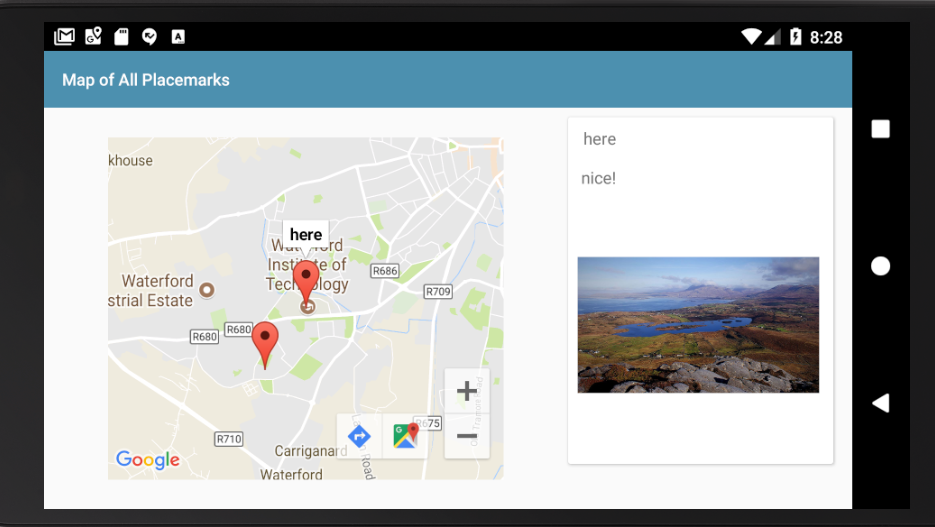

# Marker Tags

Currently, in PlacemarkMapsActivity we have this method already implemented:

## PlacemarkMapsActivity

~~~
  fun configureMap() {
    map.uiSettings.setZoomControlsEnabled(true)
    map.setOnMarkerClickListener(this)
    async(UI) {
      app.placemarks.findAll().forEach {
        val loc = LatLng(it.lat, it.lng)
        val options = MarkerOptions().title(it.title).position(loc)
        map.addMarker(options).tag = it.id
        map.moveCamera(CameraUpdateFactory.newLatLngZoom(loc, it.zoom))
      }
    }
  }
~~~

There is one very significant line in here:

~~~
        map.addMarker(options).tag = it.id
~~~

This is doing two things:

- adding a marker to the map
- "Tagging" the marker with the ID of the placemark

This means the each placemark will have the ID (from the datastore) of the placemark is is representing.

We can now use this `tag` to update the card containing details of the selected placemark. This is the current version of the onMarkerCLick event hander:

## PlacemarkListActivity

~~~
...
  override fun onMarkerClick(marker: Marker): Boolean {
    currentTitle.text = marker.title
    return false
  }
...  
~~~

Replace it with the following:

~~~
...
  override fun onMarkerClick(marker: Marker): Boolean {
    async(UI) {
      val tag = marker.tag as Long
      val placemark = app.placemarks.findById(tag)
      currentTitle.text = placemark!!.title
      currentDescription.text = placemark!!.description
      imageView.setImageBitmap(readImageFromPath(this@PlacemarkMapsActivity, placemark.image))
    }
    return false
  }
...
~~~  

Look carefully at method - when a user clicks on a placemark in the map, we do the following:

- retrieve the tag from the marker
- look up the datatore for a placemark based in this ID
- set the currentTitle, currentDescription & imageView to contains the details of the placemark

Try this out now - and make sure landmark and portrait PlacemarkMapsActivity now displays the placemark details on the panel as each marker is selected.

