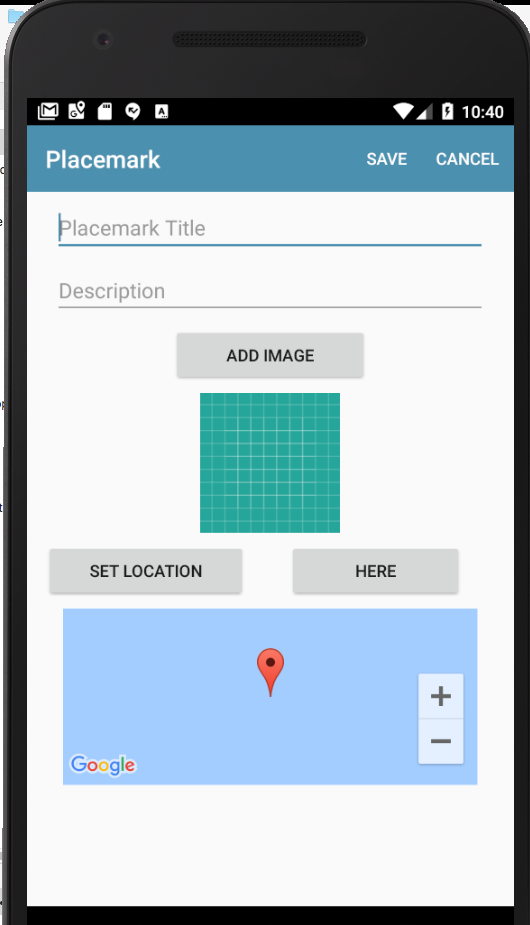

# Current Location

We would like to support retrieving the current location, and using this when a placemark is being created. We will do this by adding a new button to the PlacemarkActivity - a `here` button. This will retrieve the current location and put the placemark in that position on the map.

First - add a new button to the PlacemarkActivity

This might be the button characteristics:

~~~
    <Button
      android:id="@+id/btnHere"
      android:layout_width="147dp"
      android:layout_height="wrap_content"
      android:layout_marginBottom="8dp"
      android:layout_marginEnd="8dp"
      android:layout_marginStart="8dp"
      android:layout_marginTop="8dp"
      android:text="Here"
      app:layout_constraintBottom_toTopOf="@+id/mapView"
      app:layout_constraintEnd_toEndOf="parent"
      app:layout_constraintStart_toEndOf="@+id/placemarkLocation"
      app:layout_constraintTop_toBottomOf="@+id/placemarkImage" />
~~~

By Default we will disable this button - so in onCreate we set the button as follows:

~~~
...
  override fun onCreate(savedInstanceState: Bundle?) {
    ...
    btnHere.isEnabled = false
    ...
}
~~~

When you run the app now - make sure the button is disabled.

## build.gradle

We need new location provider libraries - so include this new entry in `build.gradle`

~~~
  implementation "com.google.android.gms:play-services-location:11.6.2"
~~~

Place it just below the google maps entry