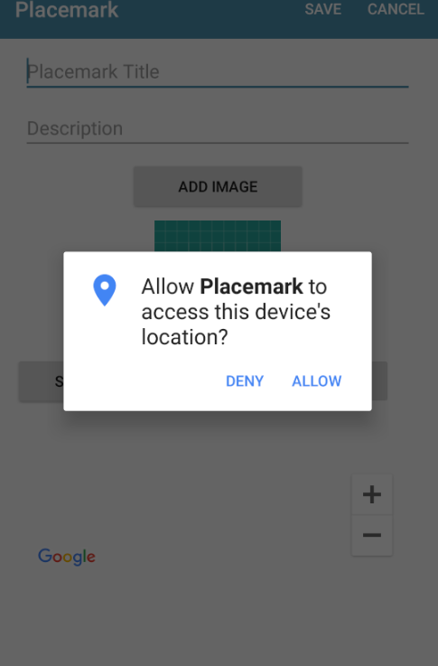

# LocationHelpers

Introduce this new class into the helpers package:

~~~
package org.wit.placemark.helpers

import android.Manifest
import android.app.Activity
import android.content.pm.PackageManager
import android.support.v4.app.ActivityCompat
import android.util.Log

val REQUEST_PERMISSIONS_REQUEST_CODE = 34

fun checkLocationPermissions(activity: Activity): Boolean {
  var success = false;
  if (ActivityCompat.checkSelfPermission(activity, Manifest.permission.ACCESS_FINE_LOCATION) == PackageManager.PERMISSION_GRANTED) {
    success = true;
  } else {
    ActivityCompat.requestPermissions(activity, arrayOf(Manifest.permission.ACCESS_FINE_LOCATION), REQUEST_PERMISSIONS_REQUEST_CODE)
  }
  return success
}

fun isPermissionGranted(code: Int, grantResults: IntArray): Boolean {
  var permissionGranted = false;
  if (code == REQUEST_PERMISSIONS_REQUEST_CODE) {
    when {
      grantResults.isEmpty() -> Log.i("Location", "User interaction was cancelled.")
      (grantResults[0] == PackageManager.PERMISSION_GRANTED) -> {
        permissionGranted = true
        Log.i("Location", "Permission Granted.")
      }
      else -> Log.i("Location", "Permission Denied.")
    }
  }
  return permissionGranted
}
~~~

These are utility methods - which are needed if we wish to access the location services on the phone.

In PlacemarkActivity - introduce these two now methods:

## PlacemarkActivity

~~~
  override fun onStart() {
    super.onStart()
    if (checkLocationPermissions(this)) {
      btnHere.isEnabled = true
    }
  }

  @SuppressLint("MissingPermission")
  override fun onRequestPermissionsResult(requestCode: Int, permissions: Array<String>, grantResults: IntArray) {
    if (isPermissionGranted(requestCode, grantResults)) {
      btnHere.isEnabled = true
    }
  }
~~~

This will specifically trigger a location permission dialog - asking the user to permit location services to be accessed.

Run the app now - and see if, when you try to create a new activity, the location services dialog appears.

Grant permissions by selecting 'allow' - the `Here` button should be activated.

Kill the app - and run it again. Does the permission screen appear? It doesn't this time - because the permission is persisted.

Try deleting the app completely - and then run it again. This time the the permission should appear again. Get used to this cycle, as it is important to understand the control flow here.