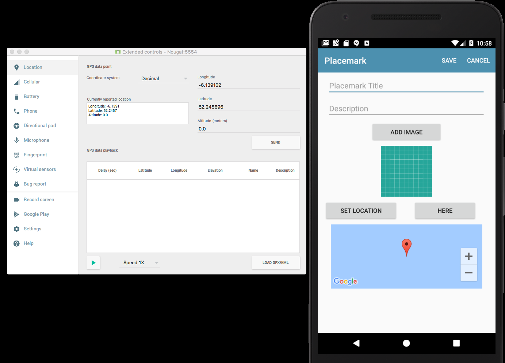

# Location Provider

Include this new field in the PlacemarkActivity class:

## PlacemarkActivity

~~~
  private lateinit var locationService: FusedLocationProviderClient
~~~

and in onCreate - initialise it:

~~~
  override fun onCreate(savedInstanceState: Bundle?) {
  	...
    locationService = LocationServices.getFusedLocationProviderClient(this)
    ...
  }
~~~

Introduce this new method:

~~~
  @SuppressLint("MissingPermission")
  fun setCurrentLocation() {
    locationService.lastLocation.addOnSuccessListener {
      defaultLocation.lat = it.latitude
      defaultLocation.lng = it.longitude
      placemark.lat = it.latitude
      placemark.lng = it.longitude
      configureMap()
    }
  }
~~~

This will use the location provider to retrieve the current location - and set the map marker to this position. It is using the location provider - and retrieving the last known location.

Finally - we can call this method of the `here` button is pressed:

~~~
    btnHere.setOnClickListener {
      setCurrentLocation()
    }
~~~

Try this now. Note that you have location options in the emulator:

It is available via the menu bar on the right.

You should be able to set a location in the emulator - and when you press 'here' it should send you to that location on the app.
