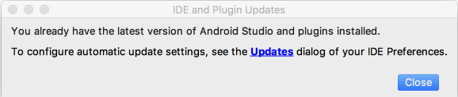

# Versions

Before proceeding, make sure you are using the latest version of Android Studio. In the `Check for updates` menu, you should see:

If not, accept updates until Studio is up to date.

Revise the main project build.gradle to include a set of variables to hold all version numbers for the project:

## build.gradle

~~~
buildscript {
  ext.kotlin_version = '1.2.31'
  ext.gradle_version = '3.1.0'

  ext.app_compat_version = '26.1.0'
  ext.design_library_version = '26.1.0'
  ext.support_library_version = '26.1.0'
  ext.cardview_library_version = '26.1.0'
  ext.constraint_layout_version = '1.0.2'

  ext.anko_version = '0.10.4'
  ext.anko_commons_version = '0.10.4'

  ext.play_services_maps_version = '12.0.1'
  ext.play_services_location_version = '12.0.1'

  ext.room_version = '1.0.0'

  repositories {
    google()
    jcenter()
  }
  dependencies {
    classpath "com.android.tools.build:gradle:$gradle_version"
    classpath "org.jetbrains.kotlin:kotlin-gradle-plugin:$kotlin_version"
  }
}

allprojects {
  repositories {
    google()
    jcenter()
  }
}

task clean(type: Delete) {
  delete rootProject.buildDir
}
~~~

Make sure this build.grade in the project home folder, not the one in the app folder.

Now we can replace the app/build.gradle with this version, which uses the version identifiers above:

## build.gradle

~~~
apply plugin: 'com.android.application'
apply plugin: 'kotlin-android'
apply plugin: 'kotlin-android-extensions'
apply plugin: "kotlin-kapt"

android {
  compileSdkVersion 26
  defaultConfig {
    applicationId "org.wit.placemark"
    minSdkVersion 23
    targetSdkVersion 26
    versionCode 1
    versionName "1.0"
    testInstrumentationRunner "android.support.test.runner.AndroidJUnitRunner"
  }
  buildTypes {
    release {
      minifyEnabled false
      proguardFiles getDefaultProguardFile('proguard-android.txt'), 'proguard-rules.pro'
    }
  }
}

androidExtensions {
  experimental = true
}

dependencies {
  implementation fileTree(dir: 'libs', include: ['*.jar'])
  implementation "org.jetbrains.kotlin:kotlin-stdlib-jre7:$kotlin_version"

  implementation "com.android.support:appcompat-v7:$app_compat_version"
  implementation "com.android.support.constraint:constraint-layout:$constraint_layout_version"
  implementation "com.android.support:design:$design_library_version"
  implementation "com.android.support:cardview-v7:$cardview_library_version"

  implementation "org.jetbrains.anko:anko:$anko_version"
  implementation "org.jetbrains.anko:anko-commons:$anko_commons_version"

  implementation "com.google.android.gms:play-services-maps:$play_services_maps_version"
  implementation "com.google.android.gms:play-services-location:$play_services_location_version"

  implementation "android.arch.persistence.room:runtime:$room_version"
  annotationProcessor "android.arch.persistence.room:compiler:$room_version"
  kapt "android.arch.persistence.room:compiler:$room_version"

  testImplementation 'junit:junit:4.12'
  androidTestImplementation 'com.android.support.test:runner:1.0.1'
  androidTestImplementation 'com.android.support.test.espresso:espresso-core:3.0.1'
}
~~~

The upgrades will break one of the kotlins sources - which must be fixed before a successful build:

## PlacemarkDao:

~~~
package org.wit.placemark.room

import android.arch.persistence.room.*
import org.wit.placemark.models.PlacemarkModel

@Dao
interface PlacemarkDao {

  @Insert(onConflict = OnConflictStrategy.REPLACE)
  fun create(placemark: PlacemarkModel)

  @Query("SELECT * FROM PlacemarkModel")
  fun findAll(): List<PlacemarkModel>

  @Query("select * from PlacemarkModel where id = :id")
  fun findById(id: Long): PlacemarkModel

  @Update
  fun update(placemark: PlacemarkModel)

  @Delete
  fun deletePlacemark(placemark: PlacemarkModel)
}
~~~

The only change here is this line:

~~~
  @Query("select * from PlacemarkModel where id = :id")
~~~

`arg0` has been replaced with `id` - as the kotlin room implementation has been aligned with the other tools.

Do a `Build->Clean` - and then a `Build->Rebuild` of the project. You may also consider uninstalling/reinstalling the app. 

