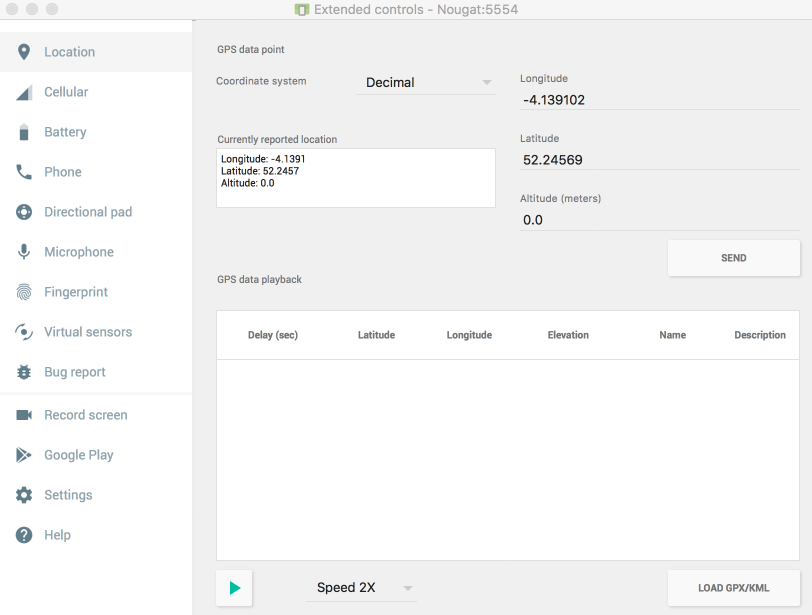

# Location Latitude/Longitude

Revise the locationCallback to recover the actual latitude/longitude:

~~~
  var locationCallback = object : LocationCallback() {
    override fun onLocationResult(locationResult: LocationResult?) {
      if (locationResult != null && locationResult.locations != null) {
        val l = locationResult.locations.last()
        info ("Location Update ${l.latitude} ${l.longitude}")
      }
    }
  }
~~~

Run the app now and monitor the logs to see specific latitude/longitudes displayed.

Experiment with the simulator location :

Notice that the update may not appear immediately - but gradually converge on the target location over time.

Finally, update the lat/lng in the view:

~~~
  var locationCallback = object : LocationCallback() {
    override fun onLocationResult(locationResult: LocationResult?) {
      if (locationResult != null && locationResult.locations != null) {
        val l = locationResult.locations.last()
        info ("Location Update ${l.latitude} ${l.longitude}")
        lat.setText(l.latitude.toString())
        lng.setText(l.longitude.toString())
      }
    }
  }
~~~

Running the app now should display the current lat/lng on screen.