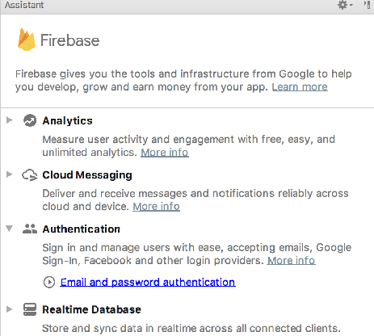
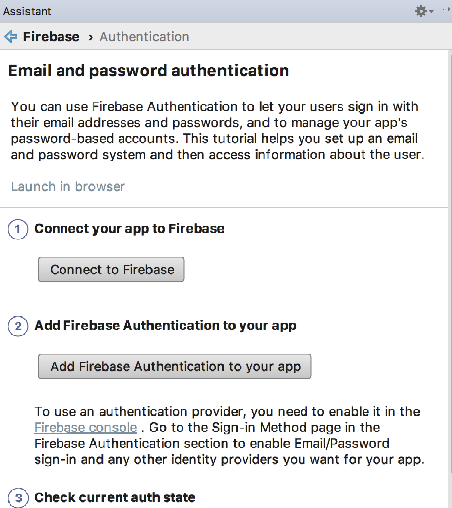

# Connect the App

Back in Android Studio, select `Tools->Firebase` - you should see the Firebase Assistant:

Select `Authentication`:

... and then select `Email and password authentication`:

Now press `Connect to Firebase`

This may require you to authenticate to firebase with your account. Once connected, you should see your firebase created app:

Select the app and press `Connect to Firebase`

This will insert a new file into your project called `google-services.json`. This file is embedded in the `app` folder. You will need to switch to the `Project` perspective in Studio in order to see it.

The assistant will also insert additional entries into your gradle files. As we are managing our gradle a little differently - we will take control of this ourselves. 

This is a revised version of the base gradle file:

## project gradle

~~~
buildscript {
  ext.kotlin_version = '1.2.31'
  ext.gradle_version = '3.1.0'
  ext.google_services_version = '3.1.1'

  ext.app_compat_version = '26.1.0'
  ext.design_library_version = '26.1.0'
  ext.support_library_version = '26.1.0'
  ext.cardview_library_version = '26.1.0'
  ext.constraint_layout_version = '1.0.2'

  ext.anko_version = '0.10.4'
  ext.anko_commons_version = '0.10.4'

  ext.play_services_maps_version = '12.0.1'
  ext.play_services_location_version = '12.0.1'
  ext.firebase_version = '12.0.1'

  ext.room_version = '1.0.0'

  repositories {
    google()
    jcenter()
  }
  dependencies {
    classpath 'com.android.tools.build:gradle:3.1.1'
    classpath "org.jetbrains.kotlin:kotlin-gradle-plugin:$kotlin_version"
    classpath "com.google.gms:google-services:$google_services_version"
  }
}

allprojects {
  repositories {
    google()
    jcenter()
  }
}

task clean(type: Delete) {
  delete rootProject.buildDir
}
~~~

The changes here are a new classpath entry - and also new version firebase:

~~~
  ext.firebase_version = '12.0.1'
~~~

This is the revised module grade:

## module gradle:

~~~
apply plugin: 'com.android.application'
apply plugin: 'kotlin-android'
apply plugin: 'kotlin-android-extensions'
apply plugin: "kotlin-kapt"

android {
  compileSdkVersion 26
  defaultConfig {
    applicationId "org.wit.placemark"
    minSdkVersion 23
    targetSdkVersion 26
    versionCode 1
    versionName "1.0"
    testInstrumentationRunner "android.support.test.runner.AndroidJUnitRunner"
  }
  buildTypes {
    release {
      minifyEnabled false
      proguardFiles getDefaultProguardFile('proguard-android.txt'), 'proguard-rules.pro'
    }
  }
}

androidExtensions {
  experimental = true
}

dependencies {
  implementation fileTree(dir: 'libs', include: ['*.jar'])
  implementation "org.jetbrains.kotlin:kotlin-stdlib-jre7:$kotlin_version"

  implementation "com.android.support:appcompat-v7:$app_compat_version"
  implementation "com.android.support.constraint:constraint-layout:$constraint_layout_version"
  implementation "com.android.support:design:$design_library_version"
  implementation "com.android.support:cardview-v7:$cardview_library_version"

  implementation "org.jetbrains.anko:anko:$anko_version"
  implementation "org.jetbrains.anko:anko-commons:$anko_commons_version"

  implementation "com.google.android.gms:play-services-maps:$play_services_maps_version"
  implementation "com.google.android.gms:play-services-location:$play_services_location_version"

  implementation "android.arch.persistence.room:runtime:$room_version"
  implementation "com.google.firebase:firebase-auth:$firebase_version"
  implementation "com.google.firebase:firebase-database:$firebase_version"

  annotationProcessor "android.arch.persistence.room:compiler:$room_version"
  kapt "android.arch.persistence.room:compiler:$room_version"

  testImplementation 'junit:junit:4.12'
  androidTestImplementation 'com.android.support.test:runner:1.0.1'
  androidTestImplementation 'com.android.support.test.espresso:espresso-core:3.0.1'
}

apply plugin: 'com.google.gms.google-services'
~~~

This include some additional firebase libraries:

~~~
  implementation "com.google.firebase:firebase-auth:$firebase_version"
  implementation "com.google.firebase:firebase-database:$firebase_version"
~~~

And also a new plugin:

~~~
apply plugin: 'com.google.gms.google-services'
~~~

Rebuild the application now to make sure all of these libraries can be incorporated correctly.
