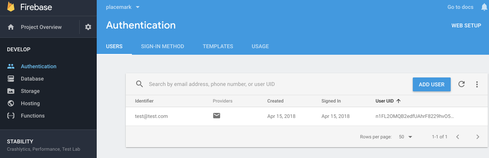

# Signup

Back in the LoginActivity class - introduce a new auth field to allow us to access the firebase Authentication service:

## LoginActivity

~~~
  lateinit var auth: FirebaseAuth
~~~

Initialize this in `onCreate`

~~~
    auth = FirebaseAuth.getInstance()
~~~

Make sure the above builds without errors now.

Revise the signup event handler now:

~~~
    signUpBtn.setOnClickListener {
      val email = field_email.text.toString()
      val password = field_password.text.toString()
      if (email == "" || password == "") {
        toast("Please provide email + password")
      }
      else {
        auth.createUserWithEmailAndPassword(email, password).addOnCompleteListener(this) { task ->
          if (task.isSuccessful) {
            info("Login success")
            startActivity(intentFor<PlacemarkListActivity>())
          }
          else {
            toast("Sign Up Failed: ${task.exception?.message}")
          }
        }
      }
    }
~~~

This will sign up a new user with the Firebase service. Try it now 

Make sure to enter a correctly formed email + a password of at least 8 characters.

The application should take you to the main Placemarks screen.

Back in the Firebase console - check the authentication panel to see if the new user is recorded:

