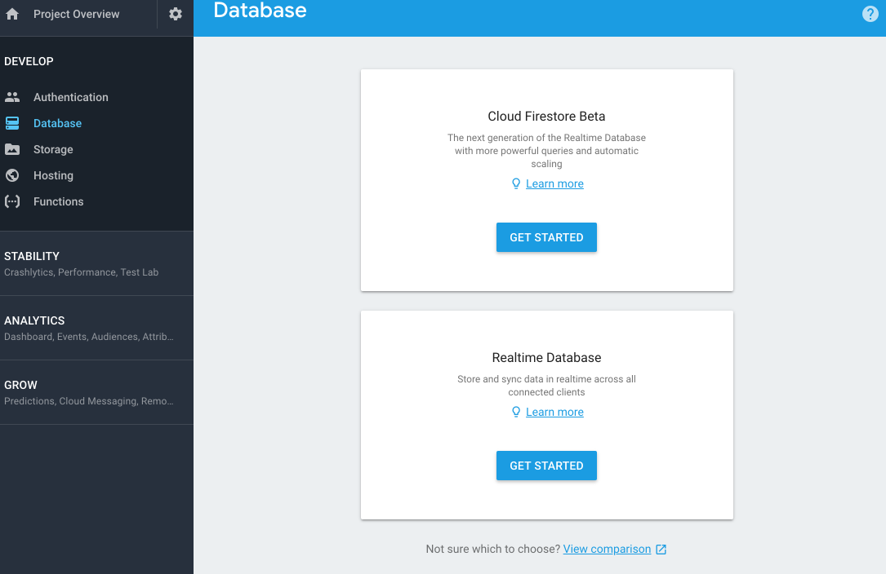
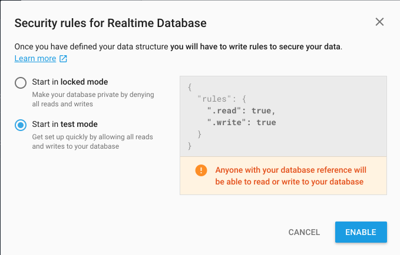
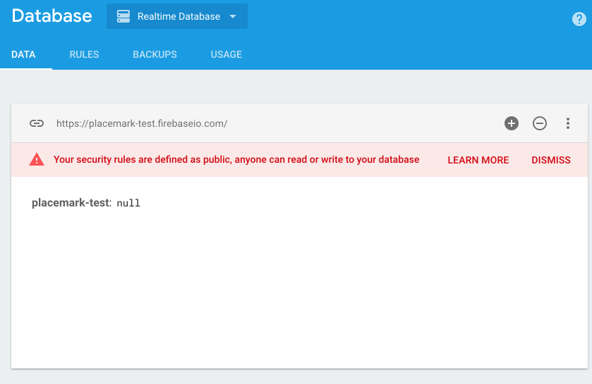
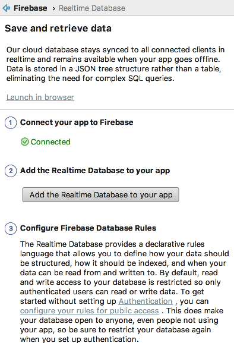

# Firebase Database

In your Firebase Application Console, select `Database`:

And press `Get Started` on `Realtime Database`:

Be sure to select `Start in test mode` as shown above.

This is a view into your database - you will see in real time here any objects you insert. Also, take note of the url:

~~~
https://placemark-XXXXd.firebaseio.co
~~~

This will be used in your application configuration. To establish the connection, in Studio select `Tools->Firebase->Realtime Database`

Press connect (screen shot above shows result of pressing connect). This is all you need to do at this stage. If you like, you can verify that the connection has been made. Do this by locating the following file:

- app/google-services.json

It may look something like this:

~~~
{
  "project_info": {
    "project_number": "4283XXXXX",
    "firebase_url": "https://placemark-XXXXd.firebaseio.com",
    "project_id": "placemark-XXXd",
  },
  "client": [
    {
      "client_info": {
        "mobilesdk_app_id": "1:428338485028:android:634c4XXXce143",
        "android_client_info": {
          "package_name": "org.wit.placemark"
        }
      },
      "oauth_client": [
        {
          "client_id": "4283XXXXX028-ntqXXXXXXXXXl9ot6ok3r.apps.googleusercontent.com",
          "client_type": 1,
          "android_info": {
            "package_name": "org.wit.placemark",
            "certificate_hash": "bcaa865ad78XXXXXXXXX731db4da8b"
          }
        },
        {
          "client_id": "42833848XXXXXX5cup7XXXXXXk8s.apps.googleusercontent.com",
          "client_type": 3
        }
      ],
      "api_key": [
        {
          "current_key": "AIzaSyBXXXXXXXXXXXoTeWhTqfKxbI"
        }
      ],
      "services": {
        "analytics_service": {
          "status": 1
        },
        "appinvite_service": {
          "status": 2,
          "other_platform_oauth_client": [
            {
              "client_id": "428338XXXXXXXXXXXXXXXXXX1e4kk8s.apps.googleusercontent.com",
              "client_type": 3
            }
          ]
        },
        "ads_service": {
          "status": 2
        }
      }
    }
  ],
  "configuration_version": "1"
}
~~~

A Firebase URL should be in the opening info object.