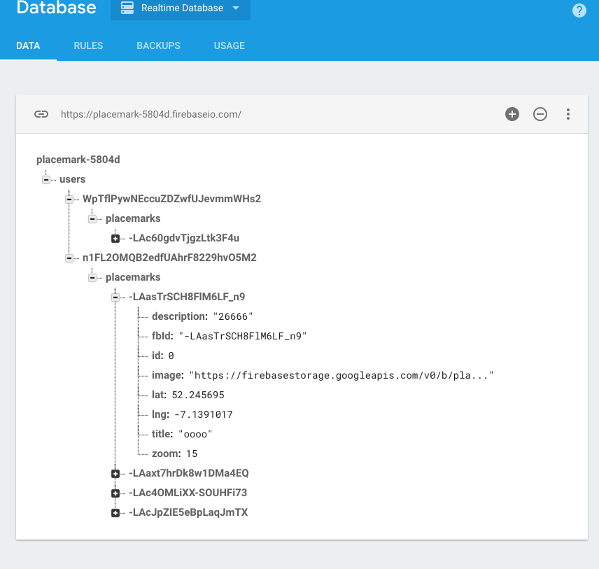

# Login

This is a revised Login activity:

## LoginActivity

~~~
package org.wit.placemark.activities

import android.os.Bundle
import android.support.v7.app.AppCompatActivity
import android.view.View
import com.google.firebase.auth.FirebaseAuth
import kotlinx.android.synthetic.main.activity_login.*
import org.jetbrains.anko.AnkoLogger
import org.jetbrains.anko.info
import org.jetbrains.anko.intentFor
import org.jetbrains.anko.toast
import org.wit.placemark.R
import org.wit.placemark.firebase.PlacemarkFireStore
import org.wit.placemark.main.MainApp

class LoginActivity : AppCompatActivity(), AnkoLogger {

  lateinit var auth: FirebaseAuth
  var fireStore: PlacemarkFireStore? = null

  override fun onCreate(savedInstanceState: Bundle?) {
    super.onCreate(savedInstanceState)
    setContentView(R.layout.activity_login)
    auth = FirebaseAuth.getInstance()

    var app = application as MainApp
    if (app.placemarks is PlacemarkFireStore) {
      fireStore = app.placemarks as PlacemarkFireStore
    }

    signUpBtn.setOnClickListener {
      val email = field_email.text.toString()
      val password = field_password.text.toString()
      if (email == "" || password == "") {
        toast("Please provide email + password")
      }
      else {
        auth.createUserWithEmailAndPassword(email, password).addOnCompleteListener(this) { task ->
          if (task.isSuccessful) {
            info("Login success")
            startActivity(intentFor<PlacemarkListActivity>())
          }
          else {
            toast("Sign Up Failed: ${task.exception?.message}")
          }
        }
      }
    }

    signInBtn.setOnClickListener {
      val email = field_email.text.toString()
      val password = field_password.text.toString()
      if (email == "" || password == "") {
        toast("Please provide email + password")
      }
      else {
        auth.signInWithEmailAndPassword(email, password).addOnCompleteListener(this) { task ->
          if (task.isSuccessful) {
            if (fireStore != null) {
              fireStore!!.fetchPlacemarks {
                startActivity(intentFor<PlacemarkListActivity>())
              }
            }
            else {
              startActivity(intentFor<PlacemarkListActivity>())
            }
          }
          else {
            toast("Sign In Failed")
          }
        }
      }
    }
  }
}
~~~

The key here is the code dealing with a successful login:

~~~
            if (fireStore != null) {
              fireStore!!.fetchPlacemarks {
                startActivity(intentFor<PlacemarkListActivity>())
              }
            }
            else {
              startActivity(intentFor<PlacemarkListActivity>())
            }
          }
~~~

In the above, we are checking to see if we are using the fireStore PlacemarkStore implementation, and if so, we fetch the placemarks and will be notified when they arrive. If we are not using the fireStore, then we just launch PlacemarkListActivity as normal.

Create the PlacemarkFireStore now in MainApp:

~~~
class MainApp : Application(), AnkoLogger {

  lateinit var placemarks: PlacemarkStore

  override fun onCreate() {
    super.onCreate()
    placemarks = PlacemarkFireStore(this)
    info("Placemark started")
  }
}
~~~

Run the app now, log in and create some placemarks. 

Keep an eye on the Database console:

You should see the placemarks you create populating here. Each users placemarks are grouped under the user id. And individual placemakrs are under their own unique id.

User Ids can be cross-referenced on the Authentication panel:

Experiment with various accounts + placemarks now. Verify that when you log in you get the placemarks relevant to the logged in user.

Also - note that the images are still stored locally. So, although they will display as normal - they will not be available if you change emulators. Perhaps try this now to verify that placemark images are localised to a specific phone.

