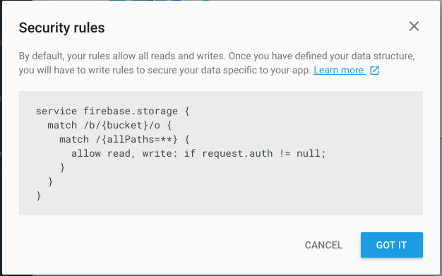

# Firebase Storage

Back in the Firebase Console, select `Storage`:

This gives a general purpose file storage area:

We will use this to store the placemark images.

In Studio, we now connect our app to the Firebase Storage system:

This will update an entry in the google-services.json file, connecting the app to the storeage system.

Here is a revised PlacemarkFireStore class, which also uploads the placemark images to the fire base storage:

~~~
package org.wit.placemark.firebase

import android.content.Context
import android.graphics.Bitmap
import com.google.firebase.auth.FirebaseAuth
import com.google.firebase.database.*
import com.google.firebase.storage.FirebaseStorage
import com.google.firebase.storage.StorageReference
import org.jetbrains.anko.AnkoLogger
import org.wit.placemark.helpers.readImageFromPath
import org.wit.placemark.models.PlacemarkModel
import org.wit.placemark.models.PlacemarkStore
import java.io.ByteArrayOutputStream
import java.io.File

class PlacemarkFireStore(val context: Context) : PlacemarkStore, AnkoLogger {

  val placemarks = ArrayList<PlacemarkModel>()
  lateinit var userId: String
  lateinit var db: DatabaseReference
  lateinit var st : StorageReference

  suspend override fun findAll(): List<PlacemarkModel> {
    return placemarks
  }

  suspend override fun findById(id: Long): PlacemarkModel? {
    val foundPlacemark: PlacemarkModel? = placemarks.find { p -> p.id == id }
    return foundPlacemark
  }

  override fun create(placemark: PlacemarkModel) {
    val key = db.child("users").child(userId).child("placemarks").push().key
    placemark.fbId = key
    placemarks.add(placemark)
    db.child("users").child(userId).child("placemarks").child(key).setValue(placemark)
    updateImage(placemark)
  }

  override fun update(placemark: PlacemarkModel) {
    var foundPlacemark: PlacemarkModel? = placemarks.find { p -> p.fbId == placemark.fbId }
    if (foundPlacemark != null) {
      foundPlacemark.title = placemark.title
      foundPlacemark.description = placemark.description
      foundPlacemark.image = placemark.image
      foundPlacemark.lat = placemark.lat
      foundPlacemark.lng = placemark.lng
      foundPlacemark.zoom = placemark.zoom
    }

    db.child("users").child(userId).child("placemarks").child(placemark.fbId).setValue(placemark)
    if ((placemark.image.length) > 0 && (placemark.image[0] != 'h')) {
      updateImage(placemark)
    }
  }

  override fun delete(placemark: PlacemarkModel) {
    db.child("users").child(userId).child("placemarks").child(placemark.fbId).removeValue()
    placemarks.remove(placemark)
  }

  override fun clear() {
    placemarks.clear()
  }

  fun updateImage(placemark: PlacemarkModel) {
    if (placemark.image != "") {
      val fileName = File(placemark.image)
      val imageName = fileName.getName()

      val bitmap = readImageFromPath(context, placemark.image)
      var imageRef = st.child(userId + '/' + imageName)
      val baos = ByteArrayOutputStream()
      bitmap!!.compress(Bitmap.CompressFormat.JPEG, 100, baos)
      val data = baos.toByteArray()
      val uploadTask = imageRef.putBytes(data)
      uploadTask.addOnFailureListener {
        println (it.message)
      }.addOnSuccessListener { taskSnapshot ->
        placemark.image = taskSnapshot.downloadUrl.toString()
        db.child("users").child(userId).child("placemarks").child(placemark.fbId).setValue(placemark)
      }
    }
  }

  fun fetchPlacemarks(placemarksReady: () -> Unit) {
    val valueEventListener = object : ValueEventListener {
      override fun onCancelled(dataSnapshot: DatabaseError?) {
      }
      override fun onDataChange(dataSnapshot: DataSnapshot?) {
        dataSnapshot!!.children.mapNotNullTo(placemarks) { it.getValue<PlacemarkModel>(PlacemarkModel::class.java) }
        placemarksReady()
      }
    }
    userId = FirebaseAuth.getInstance().currentUser!!.uid
    db = FirebaseDatabase.getInstance().reference
    st = FirebaseStorage.getInstance().reference
    placemarks.clear()
    db.child("users").child(userId).child("placemarks").addListenerForSingleValueEvent(valueEventListener)
  }
}
~~~

Try this now - add some images, and modify the Storage console to see if the images are appearing:

